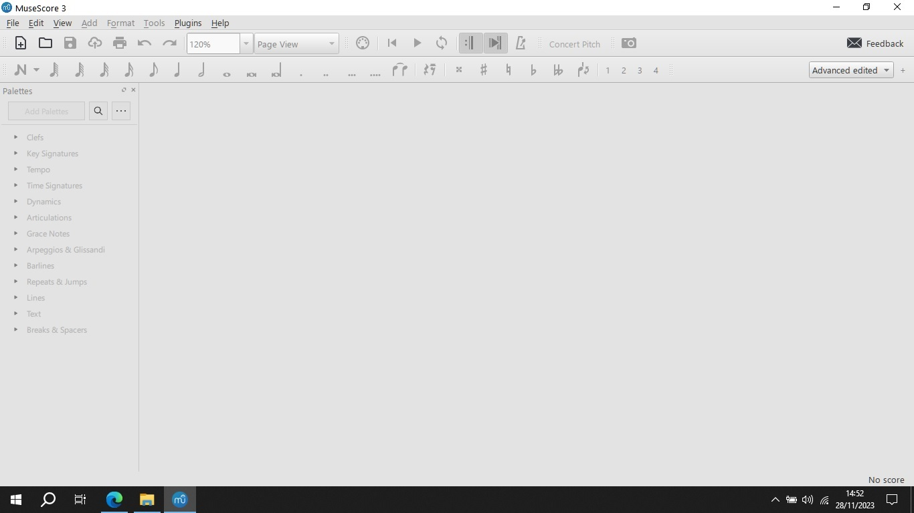
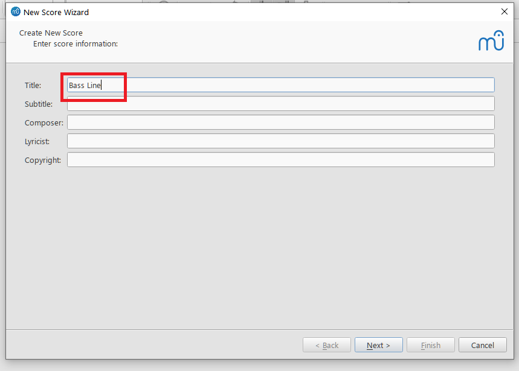
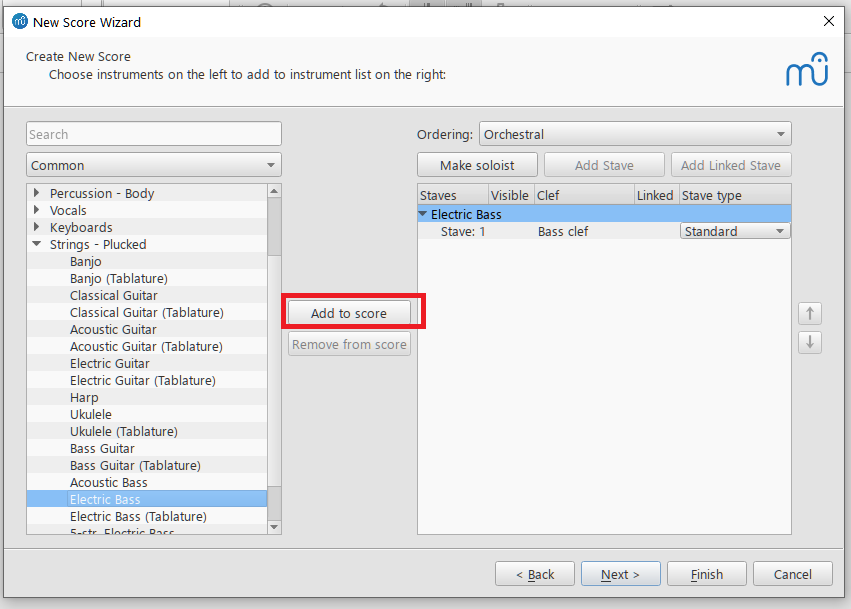
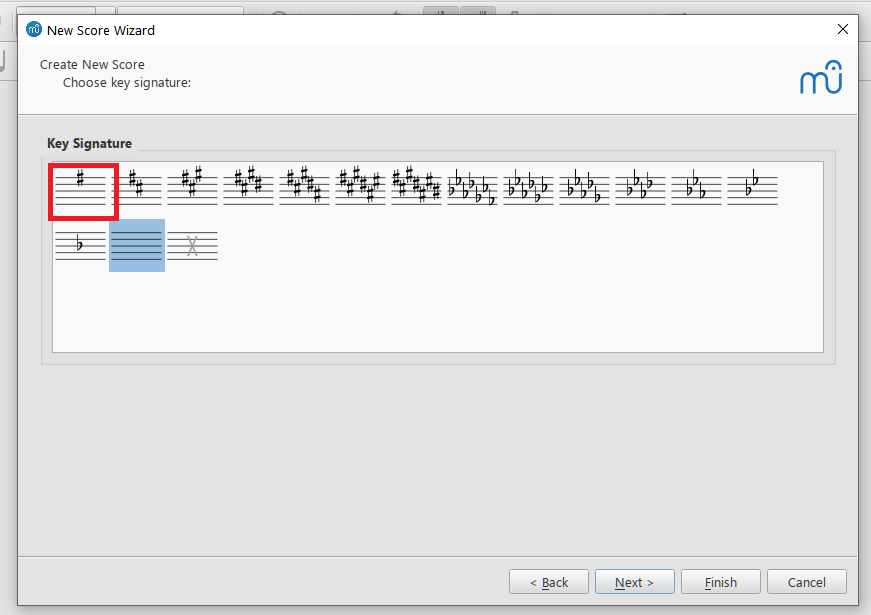
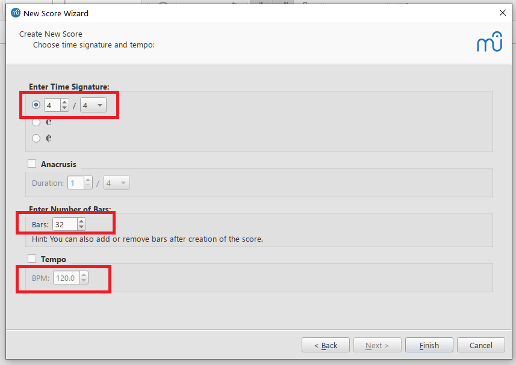
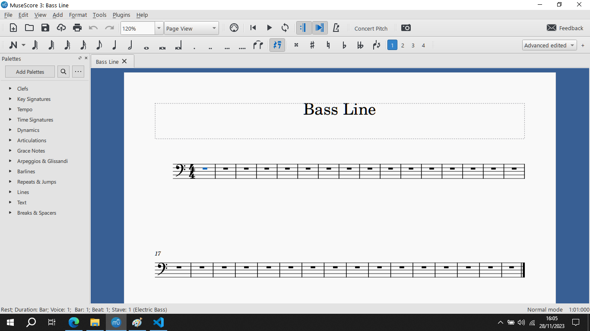

# How To Enter A Bass Line In MuseScore

By [John Saysitall](mailto:john.saysitall@great-documents.com)

In this topic, we will show you how to enter a bass line in a MuseScore document. As of this writing [MuseScore](https://musescore.org/) is at version 4.1.1, but here we will use the previous version of 3.6.2.

## Creating The Score File

When you download, install, and launch MuseScore, you will see the following screen:

You create a new document by selecting _File_ > _New_ which opens the "_New Score Wizard_" you can see below:

Here you can enter a title for the document&mdash;here, our title is simply "Bass Line"&mdash;after which you click _Next_.

In the next screen, when you click on _Choose Instruments_ a list of instruments will appear. Here, expand the _Strings - Plucked_ branch and select _Electric Bass_:

Once you've selected it, you can either double click it or click the _Add to score_ button to add the instrument to the right pane.

After this you can click _Next_ again to move to the screen where you can pick a key signature:

Here, we will pick the single-sharp (#) _E minor_ as our key and click _Next_. We arrive at the final screen where we can pick a time signature, number of bars, and tempo. We will pick the defaults and click _Finish_ to complete the wizard:

After the wizard closes, the score should look like this:

Don't forget to click _File_ > _Save_ to save your newly created score. MuseScore will provide a default filename based on the title of the score, replacing spaces with underscores&mdash;in our case, "Bass_Line".

We are now ready to start entering music.

## Entering The Music

We will assume you will be entering the notes using your mouse and keyboard.
