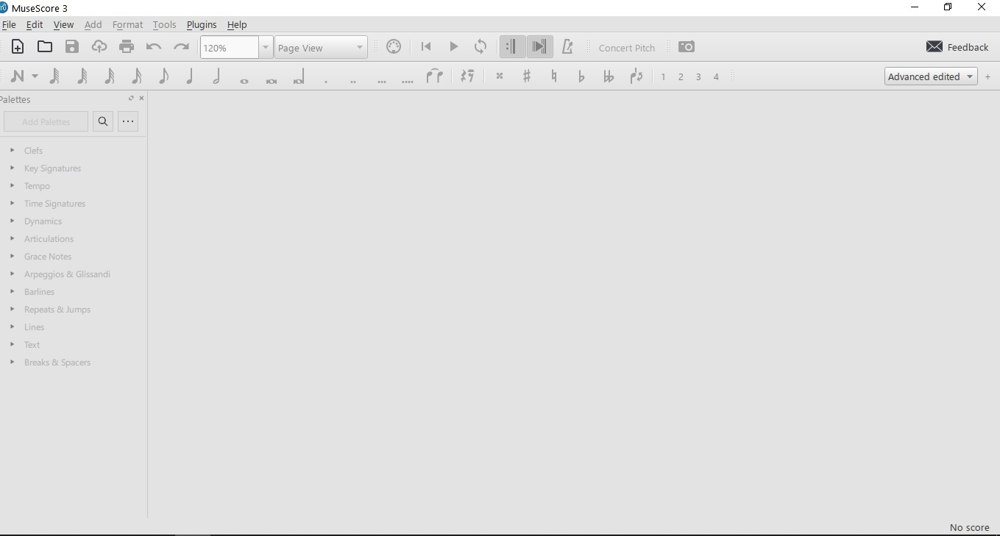
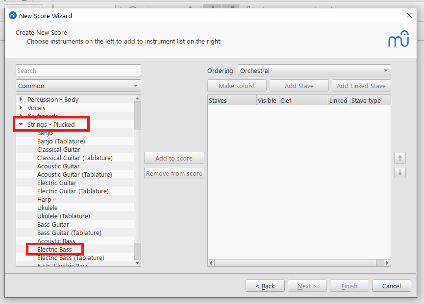
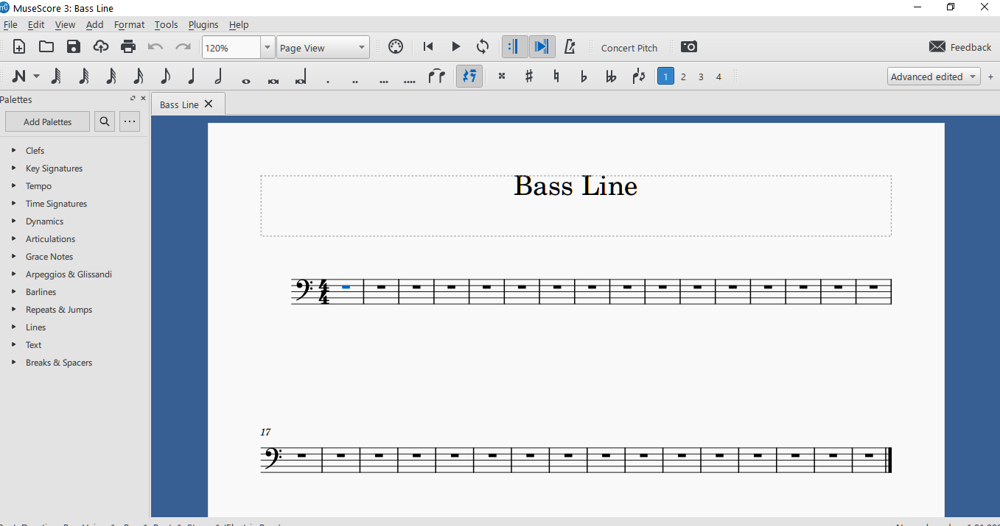
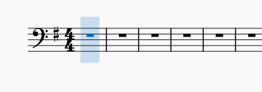
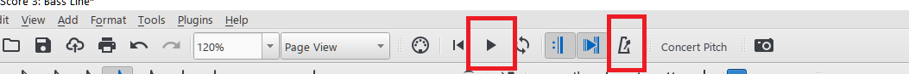

# How To Enter A Bass Line In MuseScore

By [John Saysitall](mailto:john.saysitall@great-documents.com)

In this topic, we will show you how to enter a bass line in a MuseScore document. As of this writing [MuseScore](https://musescore.org/) is at version 4.1.1, but here we will use the previous version of 3.6.2.

## Creating The Score File

When you download, install, and launch MuseScore, you will see the following screen:

You create a new document by selecting _File_ > _New_ which opens the "_New Score Wizard_" you can see below:

Here you can enter a title for the document&mdash;here, our title is simply "Bass Line"&mdash;after which you click _Next_.

In the next screen, when you click on _Choose Instruments_ a list of instruments will appear. Here, expand the _Strings - Plucked_ branch and select _Electric Bass_:

Once you've selected it, you can either double click it or click the _Add to score_ button to add the instrument to the right pane.

After this you can click _Next_ again to move to the screen where you can pick a key signature:

Here, we will pick the single-sharp (#) _E minor_ as our key and click _Next_. We arrive at the final screen where we can pick a time signature, number of bars, and tempo. We will pick the defaults and click _Finish_ to complete the wizard:

After the wizard closes, the score should look like this:

Don't forget to click _File_ > _Save_ to save your newly created score. MuseScore will provide a default filename based on the title of the score, replacing spaces with underscores&mdash;in our case, that will be "Bass_Line".

We are now ready to start entering music.

## Entering The Music

We will assume you will enter the notes using your mouse and keyboard. To start entering notes, click on the note entry drow down box (the _N_ shaped one) at the beginning of the lower toolbar.

For our purposes, the first option&mdash;_Note Input_&mdash;is good enough. Note that this command can be accessed by simply typing _N_ on your keyboard. Clicking this option activates the note entry process which is indicated on the staff with a transparent blue vertical rectangle.

Now, if you can easily enter notes by typing their letters on the keyboard, that is fine. But we will first try a more __visual__ method: we will use the onscreen keyboard. Typing _P_ on the keyboard opens a piano keyboard at the bottom of the score screen.

By clicking on the notes while note entry is activated, we can enter the notes of our bass line. For time values, the second toolbar provides options for whole, half, quarter, etc. notes. By default, the quarter note is selected.

You can see the first few bars of our line entered below:

To enter "ties"&mdash;i.e. to connect note heads to extend their duration&mdash;you can use the _Tie_ button on the second toolbar.

When you're done entering your notes, you can press the _Play_ button to play back the score you have entered until then. If you want to hear the underlying beat, you can press the metronome button in the second red box.

