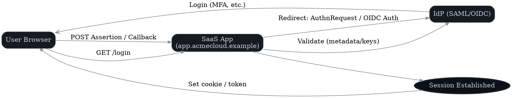

# Installation & Setup Guide (SaaS + Optional Self-Hosted Agent)

**Author:** Koray Erkan (portfolio sample)
**Version:** 0.1 — <update date here>

> 🎯 **Purpose**
> Ensure a smooth first-time setup. Audience: Admins/IT. Scope: prerequisites, installation, configuration, validation, rollback.

---

## Prerequisites

| Category | Requirement | Notes |
|----------|-------------|-------|
| Identity | SAML or OIDC IdP | Okta, Azure AD, or Google Workspace supported |
| Network | HTTPS egress to `*.example.com` | Allowlist on corporate firewall/proxy |
| Browser | Latest Chrome/Edge/Firefox/Safari | Enable cookies and local storage |
| Roles | Org Admin account | Needed for SSO, SCIM, billing, settings |
| (Agent) OS | Linux x86_64 (Ubuntu 20.04+/RHEL 8+) | 2 vCPU, 4 GB RAM, 10 GB disk |
| (Agent) Ports | Outbound 443 | No inbound ports required |

---

## Cloud Installation

1. **Sign up / Org creation**
   Go to `https://app.acmecloud.example` and create your organization.
2. **Domain verification**
   Add the provided TXT record to DNS, then click **Verify**.
3. **Billing (optional)**
   Select a plan, add payment method, confirm invoice recipient.
4. **Initial admin config**
   Set org name, time zone, and default region.

---

## Optional: Self-Hosted Agent

### System Requirements

- Linux x86_64, 2 vCPU, 4 GB RAM, 10 GB disk
- Outbound HTTPS (443) to `agent.acmecloud.example`
- Systemd for service management

### Install Example

```bash
curl -fsSL https://downloads.acmecloud.example/agent/v1.2.3/agent-linux-amd64.tgz -o agent.tgz
tar xzf agent.tgz && sudo mv agent /usr/local/bin/agent
sudo systemctl enable --now agent
sudo systemctl status agent
```



```graphviz
// agent-connectivity.dot
digraph G {
  graph [rankdir=LR, splines=true, bgcolor="transparent", nodesep=0.7, ranksep=0.9];
  node  [shape=rounded, style="filled,rounded", fillcolor="#161b22", color="#30363d", fontcolor="#c9d1d9", penwidth=1.2];
  edge  [color="#8b949e", arrowsize=0.9, penwidth=1.3];

  subgraph cluster_cust {
    label="Customer Network";
    labelloc="t"; fontsize=12;
    color="#30363d"; fontcolor="#c9d1d9"; style="rounded,dashed";
    agent [label="ACME Agent\n(systemd service)"];
    fw    [label="Egress Firewall/Proxy", shape=box, style="filled", fillcolor="#0d1117"];
  }

  subgraph cluster_cloud {
    label="SaaS Cloud";
    labelloc="t"; fontsize=12;
    color="#30363d"; fontcolor="#c9d1d9"; style="rounded,dashed";
    api   [label="Agent Ingress\nagent.acmecloud.example:443", shape=box, style="filled", fillcolor="#0d1117"];
    ctrl  [label="Control Plane\n(config, tokens)"];
    telem [label="Telemetry\n(health, logs)"];
  }

  // outbound-only TLS
  agent -> fw  [label="TLS 1.2+ 443", fontcolor="#8b949e"];
  fw    -> api [label="allowlist *.acmecloud.example", fontcolor="#8b949e"];

  // control/telemetry (logical paths)
  api -> ctrl  [label="register / fetch config"];
  api -> telem [label="healthbeat"];

  // notes
  note1 [label="No inbound ports required", shape=note, fillcolor="#0d1117"];
  note2 [label="Rotate provisioning token regularly", shape=note, fillcolor="#0d1117"];

  agent -> note1 [style=dotted, arrowhead=none, color="#484f58"];
  ctrl  -> note2 [style=dotted, arrowhead=none, color="#484f58"];
}
```

### Health Check

```bash
curl -I https://agent.acmecloud.example/health
```

---

## Configuration

### Single Sign-On (SAML/OIDC)

- Configure IdP with:
  - **ACS / Redirect URI:** `https://app.acmecloud.example/auth/callback`
  - **Entity ID:** `https://app.acmecloud.example`
- Upload IdP metadata or client credentials.
- Test with a pilot group before enforcing.



### SCIM Provisioning

- Enable SCIM in **Admin → Provisioning**.
- Configure in IdP with base URL and bearer token.
- Sync one group before production rollout.

### API Keys & Webhooks

- **API Keys:** Create with least-privilege scopes.
- **Webhooks:** Add endpoint, verify 2xx response, set retry policy.

---

## Validation & Smoke Tests

- [ ] Login via SSO (pilot user)
- [ ] Create workspace + project
- [ ] Invite teammate → teammate signs in
- [ ] Create + assign task → confirm activity log
- [ ] Export CSV report → verify columns/timezone
- [ ] (If agent installed) Agent shows **Healthy** in **Admin → Connectors**

---

## Troubleshooting

| Symptom | Likely Cause | Resolution |
|---------|--------------|------------|
| SSO login loop | ACS/Audience mismatch, clock skew | Re-check IdP settings; ensure NTP enabled |
| 403 after SSO | Role not mapped | Map IdP group → app role; resync |
| Webhooks not firing | Firewall or proxy blocks | Allowlist destination; retry |
| Slow exports | Large dataset | Use async export; filter or paginate |
| Agent unhealthy | Token invalid, egress blocked | Rotate token; check outbound 443/DNS |

---

## Rollback

1. Revert SSO enforcement to optional.
2. Pause SCIM provisioning.
3. Stop and remove the agent service.
4. Remove DNS TXT verification if decommissioning.
5. Verify backups/exports before full rollback.
