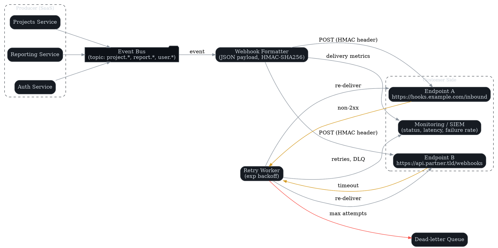

# Maintenance & Troubleshooting

**Author:** Koray Erkan (portfolio sample)
**Version:** 0.1 — <update date here>

---

## Routine Maintenance

- [ ] Verify backups complete successfully (weekly)
- [ ] Perform test restores (monthly)
- [ ] Review data retention policies (quarterly)
- [ ] Rotate API keys and secrets (annually or on compromise)

---

## Monitoring

- [ ] Check health endpoints (`/health`, `/status`)
- [ ] Aggregate logs in SIEM/ELK stack
- [ ] Review alerts against thresholds (CPU, memory, latency, error rates)

Example health check:

```bash
curl -s https://api.acmecloud.example/v1/health | jq
```



---

## Troubleshooting Playbooks

| Symptom            | Likely Cause        | Resolution |
|--------------------|---------------------|------------|
| Login loop         | IdP misconfiguration | Verify ACS URL, certificate, and system clock |
| Webhooks not firing| Firewall / DNS       | Check firewall allowlist, retry policy |
| Slow exports       | Large datasets       |
