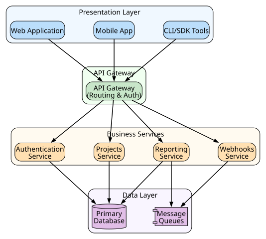

# Conceptual / Architecture Overview

**Author:** John Saysitall
**Version:** 0.1 — <update date here>

---

## High-Level Architecture

// conceptual-architecture.dot

---

## Data Model (Overview)

- **Workspace** — Organizational container managing projects and user access
- **Project** — Work unit encompassing tasks, dashboards, and deliverables
- **Task** — Actionable item with status tracking, assignment, and scheduling
- **User** — Authenticated identity with role-based permissions and capabilities

---

## Integration Patterns

- **Webhooks:** Event-driven notifications for create/update/delete operations
- **REST API:** Standardized CRUD operations with batch reporting capabilities
- **Data ingestion:** CSV file uploads and S3-based data connectors
- **Identity integration:** SAML/OIDC authentication with SCIM-based user provisioning

---

## Performance & Scaling Notes

- Redis-based caching layer for optimized read operations
- Asynchronous job processing via message queues (reports, notifications)
- Token-based rate limiting (default: 1000 requests/minute)
- Idempotent API design preventing duplicate operations

---

## Limitations & Future Work

- Current scale limit: **10,000 users per organizational instance**
- File upload constraint: **100 MB maximum per individual file**
- SCIM group synchronization: Okta support (Azure AD integration in development)
- Roadmap: Multi-region data replication for enhanced performance
