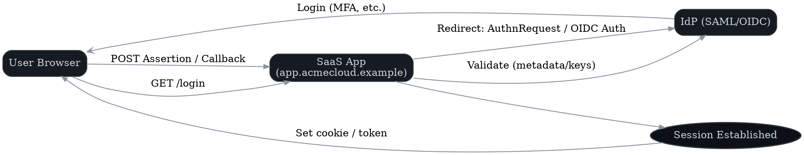

# Installation & Setup Guide (SaaS + Optional Self-Hosted Agent)

**Author:** Koray Erkan (portfolio sample)
**Version:** 0.1 — <update date here>

> 🎯 **Purpose**
> Ensure a smooth first-time setup. Audience: Admins/IT. Scope: prerequisites, installation, configuration, validation, rollback.

---

## Prerequisites

| Category | Requirement | Notes |
|----------|-------------|-------|
| Identity Provider | SAML or OIDC compatibility | Okta, Azure AD, Google Workspace supported |
| Network Connectivity | HTTPS egress to `*.example.com` | Corporate firewall/proxy allowlist configuration required |
| Browser Support | Latest Chrome/Edge/Firefox/Safari | Cookie and local storage functionality enabled |
| Administrative Access | Organization Admin privileges | Required for SSO, SCIM, billing, and configuration management |
| (Agent) Operating System | Linux x86_64 (Ubuntu 20.04+/RHEL 8+) | Minimum: 2 vCPU, 4 GB RAM, 10 GB storage |
| (Agent) Network | Outbound HTTPS (443) only | No inbound connectivity requirements |

---

## Cloud Installation

1. **Organization registration**
   Navigate to `https://app.acmecloud.example` and establish your organizational account.
2. **Domain ownership verification**
   Configure the provided TXT record in DNS management, then execute **Verify**.
3. **Billing configuration (optional)**
   Select subscription tier, configure payment method, designate invoice recipient.
4. **Administrative setup**
   Define organization name, timezone preferences, and default regional deployment.

---

## Optional: Self-Hosted Agent

### System Requirements

- Linux x86_64 architecture with 2 vCPU, 4 GB RAM, 10 GB storage minimum
- Outbound HTTPS connectivity (port 443) to `agent.acmecloud.example`
- Systemd service management capability for daemon operations

### Install Example

```bash
curl -fsSL https://downloads.acmecloud.example/agent/v1.2.3/agent-linux-amd64.tgz -o agent.tgz
tar xzf agent.tgz && sudo mv agent /usr/local/bin/agent
sudo systemctl enable --now agent
sudo systemctl status agent
```



```graphviz
// agent-connectivity.dot
digraph G {
  graph [rankdir=LR, splines=true, bgcolor="transparent", nodesep=0.7, ranksep=0.9];
  node  [shape=rounded, style="filled,rounded", fillcolor="#161b22", color="#30363d", fontcolor="#c9d1d9", penwidth=1.2];
  edge  [color="#8b949e", arrowsize=0.9, penwidth=1.3];

  subgraph cluster_cust {
    label="Customer Network";
    labelloc="t"; fontsize=12;
    color="#30363d"; fontcolor="#c9d1d9"; style="rounded,dashed";
    agent [label="ACME Agent\n(systemd service)"];
    fw    [label="Egress Firewall/Proxy", shape=box, style="filled", fillcolor="#0d1117"];
  }

  subgraph cluster_cloud {
    label="SaaS Cloud";
    labelloc="t"; fontsize=12;
    color="#30363d"; fontcolor="#c9d1d9"; style="rounded,dashed";
    api   [label="Agent Ingress\nagent.acmecloud.example:443", shape=box, style="filled", fillcolor="#0d1117"];
    ctrl  [label="Control Plane\n(config, tokens)"];
    telem [label="Telemetry\n(health, logs)"];
  }

  // outbound-only TLS
  agent -> fw  [label="TLS 1.2+ 443", fontcolor="#8b949e"];
  fw    -> api [label="allowlist *.acmecloud.example", fontcolor="#8b949e"];

  // control/telemetry (logical paths)
  api -> ctrl  [label="register / fetch config"];
  api -> telem [label="healthbeat"];

  // notes
  note1 [label="No inbound ports required", shape=note, fillcolor="#0d1117"];
  note2 [label="Rotate provisioning token regularly", shape=note, fillcolor="#0d1117"];

  agent -> note1 [style=dotted, arrowhead=none, color="#484f58"];
  ctrl  -> note2 [style=dotted, arrowhead=none, color="#484f58"];
}
```

### Health Check

```bash
curl -I https://agent.acmecloud.example/health
```

---

## Configuration

### Single Sign-On (SAML/OIDC)

- Configure Identity Provider parameters:
  - **ACS / Redirect URI:** `https://app.acmecloud.example/auth/callback`
  - **Entity ID:** `https://app.acmecloud.example`
- Import IdP metadata or establish client credential configuration.
- Execute pilot group testing before production enforcement.



### SCIM Provisioning

- Activate SCIM functionality via **Admin → Provisioning**.
- Configure Identity Provider with base URL and bearer token authentication.
- Validate single group synchronization before full production deployment.

### API Keys & Webhooks

- **API Keys:** Generate with minimal required permissions following least-privilege principles.
- **Webhooks:** Configure endpoint URLs, validate 2xx response codes, establish retry policies.

---

## Validation & Smoke Tests

- [ ] Authenticate via SSO with pilot user account
- [ ] Establish workspace and initial project
- [ ] Execute teammate invitation workflow and validate sign-in
- [ ] Create and assign task, verify activity logging
- [ ] Generate CSV report export and validate data/timezone accuracy
- [ ] (Agent deployment) Confirm **Healthy** status in **Admin → Connectors**

---

## Troubleshooting

| Symptom | Likely Cause | Resolution |
|---------|--------------|------------|
| SSO authentication loops | ACS/Audience configuration mismatch, clock synchronization issues | Validate IdP configuration parameters; ensure NTP synchronization |
| Post-SSO authorization failure | Role mapping not configured | Establish IdP group to application role mapping; execute resynchronization |
| Webhook delivery failures | Network firewall or proxy restrictions | Configure destination allowlists; verify retry policy settings |
| Export performance degradation | Large dataset processing overhead | Implement asynchronous exports; apply filtering or pagination |
| Agent connectivity issues | Authentication token expiration, network egress restrictions | Execute token rotation; verify outbound HTTPS/DNS connectivity |

---

## Rollback

1. Disable SSO enforcement, reverting to optional authentication.
2. Suspend SCIM user provisioning operations.
3. Terminate and uninstall agent service daemon.
4. Remove DNS TXT verification records during decommissioning.
5. Validate backup integrity and data exports before complete rollback execution.
