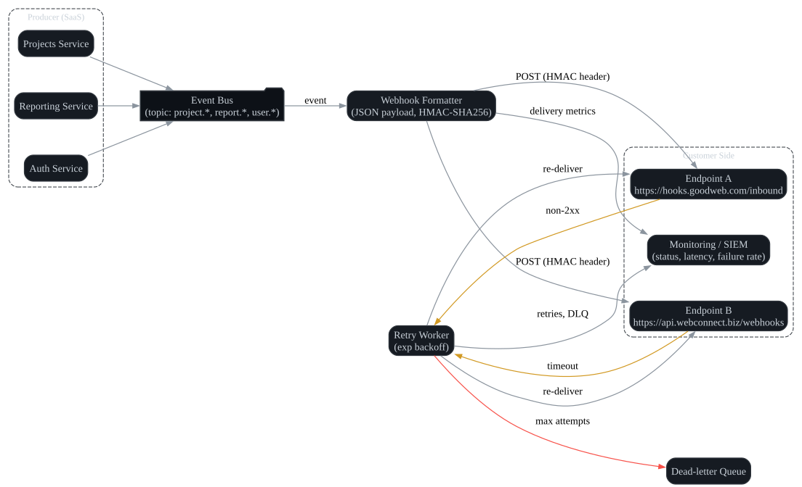

# Maintenance and Troubleshooting

**Author:** John Saysitall  
**Version:** 2.3 — December 2024  
**Product Version:** CloudFlow Pro 3.4.2

---

## Routine Maintenance

### Backup and Recovery Operations

- **[ ] Validate backup completion and integrity (weekly schedule)**
  
  CloudFlow Pro performs automated daily backups at 02:00 UTC. Weekly validation ensures data integrity and recovery readiness.

  ```bash
  # Verify latest backup completion
  cloudflow admin backup status --last-7-days
  
  # Test backup integrity
  cloudflow admin backup verify --date "2024-12-08" --full-check
  
  # Generate backup report
  cloudflow admin backup report --format pdf --output "backup-weekly-report.pdf"
  ```

  **Backup validation checklist:**
  - [ ] Database snapshot completeness (primary + replica consistency)
  - [ ] File storage synchronization (attachments, exports, logs)  
  - [ ] Encryption key availability and rotation status
  - [ ] Cross-region replication validation (Enterprise only)
  - [ ] Backup retention policy adherence (90 days standard, 7 years compliance)

  **Expected backup sizes by deployment:**
  | Deployment Size | Daily Backup | Weekly Full | Monthly Archive |
  |-----------------|--------------|-------------|-----------------|
  | Small (< 1K users) | 2-5 GB | 15-25 GB | 100-150 GB |
  | Medium (1-5K users) | 10-20 GB | 75-125 GB | 500-750 GB |
  | Large (5-10K users) | 25-50 GB | 200-350 GB | 1.2-2TB |
  | Enterprise (10K+ users) | 50-100 GB | 400-700 GB | 2.5-5TB |

- **[ ] Execute test restoration procedures (monthly validation)**

  Monthly disaster recovery testing ensures RTO (Recovery Time Objective) compliance and operational readiness.

  ```bash
  # Create isolated test environment
  cloudflow admin restore create-test-env \
    --backup-date "2024-11-30" \
    --environment "disaster-recovery-test" \
    --network-isolation=true

  # Execute restoration workflow
  cloudflow admin restore execute \
    --environment "disaster-recovery-test" \
    --components "database,file-storage,cache,search-index" \
    --validation-mode=true

  # Performance validation post-restore
  cloudflow admin validate performance \
    --environment "disaster-recovery-test" \
    --load-test-suite "standard" \
    --duration 30m
  ```

  **Recovery Time Objectives (RTO):**
  - Database restore: < 2 hours (Standard), < 30 minutes (Enterprise)
  - File storage sync: < 4 hours (Standard), < 1 hour (Enterprise)  
  - Search index rebuild: < 6 hours (Standard), < 2 hours (Enterprise)
  - Full system availability: < 8 hours (Standard), < 4 hours (Enterprise)

  **Restoration validation metrics:**
  - [ ] User authentication success rate > 99.5%
  - [ ] API response latency < 500ms (p95)
  - [ ] Data consistency across all services
  - [ ] Real-time notification delivery functionality
  - [ ] Third-party integration connectivity

- **[ ] Audit data retention policy compliance (quarterly review)**

  Quarterly compliance audits ensure adherence to data protection regulations and organizational policies.

  ```bash
  # Generate data retention compliance report
  cloudflow admin compliance audit \
    --type "data-retention" \
    --regulations "GDPR,CCPA,SOX" \
    --export-format "xlsx" \
    --include-remediation-plan

  # Review data classification and retention schedules  
  cloudflow admin data-classification review \
    --classification-levels "public,internal,confidential,restricted" \
    --retention-periods "30d,1y,7y,permanent" \
    --auto-purge-preview

  # Execute data purging for expired records
  cloudflow admin data-purge execute \
    --dry-run \
    --categories "deleted-projects,inactive-users,audit-logs" \
    --older-than "7y" \
    --confirmation-required
  ```

  **Data retention schedules:**
  | Data Type | Retention Period | Purge Method | Compliance Requirement |
  |-----------|------------------|--------------|------------------------|
  | User activity logs | 2 years | Automated soft delete | GDPR Article 17 |
  | Project data (active) | Indefinite | User-controlled | Business requirement |
  | Project data (deleted) | 90 days | Secure wipe | Data minimization |
  | Audit trail | 7 years | Encrypted archive | SOX compliance |
  | Personal data (GDPR) | User-requested deletion | Crypto shredding | Right to erasure |
  | Security logs | 1 year | Secure deletion | ISO 27001 |

- **[ ] Implement API key and secret rotation (annual cycle or upon compromise)**

  Regular credential rotation reduces security exposure and maintains compliance with enterprise security policies.

  ```bash
  # Generate API key rotation plan
  cloudflow admin security key-rotation plan \
    --scope "all-integrations" \
    --notification-window "30d" \
    --rollback-window "7d"

  # Execute staged rotation (non-breaking)
  cloudflow admin security key-rotation execute \
    --stage "prepare" \
    --new-key-overlap "72h" \
    --notify-integrations=true

  # Validate integration health during rotation
  cloudflow admin security validate-integrations \
    --test-endpoints \
    --check-authentication \
    --monitor-error-rates

  # Complete rotation and deprecate old keys
  cloudflow admin security key-rotation complete \
    --deprecate-old-keys \
    --grace-period "24h" \
    --force-update-webhooks
  ```

  **Rotation schedule and procedures:**
  | Credential Type | Rotation Frequency | Advance Notice | Rollback Window |
  |-----------------|-------------------|----------------|-----------------|
  | API keys (integration) | Annual | 30 days | 7 days |
  | Service tokens | Bi-annual | 14 days | 24 hours |
  | Database passwords | Quarterly | N/A (automatic) | 1 hour |
  | Encryption keys | Annual | 60 days | 30 days |
  | SSL certificates | Before expiry | 90 days | 24 hours |
  | OAuth secrets | Bi-annual | 30 days | 7 days |

---

## Monitoring

### System Health and Performance Monitoring

- **[ ] Monitor system health endpoints (`/health`, `/status`) for availability**

  Continuous monitoring ensures proactive identification of system degradation and service interruptions.

  ```bash
  # Configure comprehensive health monitoring
  cloudflow admin monitoring configure \
    --endpoints "/health,/status,/metrics,/readiness" \
    --check-interval "30s" \
    --timeout "10s" \
    --retry-attempts 3

  # Set up automated health checks with alerting
  cloudflow admin monitoring health-check \
    --services "api,database,cache,queue,search" \
    --thresholds "response_time:500ms,error_rate:1%,uptime:99.9%" \
    --alert-channels "email,slack,pagerduty"
  ```

  **Health check endpoints and expected responses:**

  | Endpoint | Purpose | Healthy Response | Critical Thresholds |
  |----------|---------|------------------|-------------------|
  | `/health` | Overall system status | HTTP 200, < 100ms | > 500ms response time |
  | `/status` | Component-level status | All services "UP" | Any service "DOWN" |
  | `/metrics` | Performance metrics | Prometheus format | Memory > 85%, CPU > 80% |
  | `/readiness` | Traffic acceptance | HTTP 200 | Database connectivity failure |

  Sample health check automation:
  ```bash
  #!/bin/bash
  # Health monitoring script (run every 30 seconds via cron)
  
  HEALTH_URL="https://api.cloudflow.goodweb.com/v1/health"
  STATUS_URL="https://api.cloudflow.goodweb.com/v1/status"
  
  # Check overall health
  HEALTH_RESPONSE=$(curl -s -w "%{http_code}" -o /tmp/health.json "$HEALTH_URL")
  
  if [ "$HEALTH_RESPONSE" != "200" ]; then
    echo "CRITICAL: Health check failed with status $HEALTH_RESPONSE"
    # Trigger alert
    cloudflow admin alert send \
      --severity critical \
      --message "CloudFlow API health check failure" \
      --escalate-to "oncall-engineer"
  fi
  
  # Validate component status
  UNHEALTHY_SERVICES=$(curl -s "$STATUS_URL" | jq -r '.services[] | select(.status != "UP") | .name')
  
  if [ ! -z "$UNHEALTHY_SERVICES" ]; then
    echo "WARNING: Unhealthy services detected: $UNHEALTHY_SERVICES"
    cloudflow admin alert send \
      --severity warning \
      --message "Service degradation: $UNHEALTHY_SERVICES" \
      --auto-remediate=true
  fi
  ```

- **[ ] Centralize log aggregation through SIEM/ELK infrastructure**

  Centralized logging enables comprehensive security monitoring, performance analysis, and troubleshooting capabilities.

  ```bash
  # Configure log shipping to ELK stack
  cloudflow admin logging configure \
    --destination "elasticsearch://elk.company.com:9200" \
    --index-pattern "cloudflow-logs-{YYYY.MM.dd}" \
    --retention "30d" \
    --compression "gzip"

  # Set up structured logging with proper fields
  cloudflow admin logging format \
    --format "json" \
    --fields "timestamp,level,service,user_id,session_id,request_id,message" \
    --sensitive-data-masking=true

  # Configure log levels by service
  cloudflow admin logging levels \
    --api-service "INFO" \
    --auth-service "WARN" \
    --webhook-service "DEBUG" \
    --background-jobs "INFO"
  ```

  **Log aggregation configuration:**

  | Log Source | Volume (per day) | Retention | Index Strategy |
  |------------|------------------|-----------|----------------|
  | API Gateway | 50-100 GB | 30 days | Daily rolling |
  | Application logs | 20-40 GB | 90 days | Weekly rolling |
  | Security logs | 5-10 GB | 1 year | Monthly rolling |
  | Performance metrics | 10-20 GB | 30 days | Daily rolling |
  | Audit trail | 1-5 GB | 7 years | Yearly archive |

  **SIEM integration and alerting rules:**
  ```bash
  # Configure security event detection
  cloudflow admin siem rules create \
    --rule-name "suspicious-login-patterns" \
    --condition "failed_logins > 10 AND time_window = 5m" \
    --action "block-ip,send-alert" \
    --severity "high"

  cloudflow admin siem rules create \
    --rule-name "unusual-api-usage" \
    --condition "api_calls > 1000/minute AND user_type != 'service'" \
    --action "rate-limit,notify-admin" \
    --severity "medium"

  # Set up compliance logging
  cloudflow admin siem compliance \
    --frameworks "SOC2,ISO27001,PCI-DSS" \
    --audit-events "login,data-access,admin-action,config-change" \
    --reporting-schedule "monthly"
  ```

- **[ ] Evaluate alerting thresholds for CPU, memory, latency, and error rates**

  Proactive threshold monitoring prevents performance degradation and ensures optimal user experience.

  ```bash
  # Configure performance monitoring thresholds
  cloudflow admin monitoring thresholds set \
    --cpu-warning "75%" \
    --cpu-critical "90%" \
    --memory-warning "80%" \
    --memory-critical "95%" \
    --disk-warning "85%" \
    --disk-critical "95%"

  # Set application-specific thresholds
  cloudflow admin monitoring app-thresholds \
    --api-latency-p95 "500ms" \
    --api-latency-p99 "2000ms" \
    --error-rate-warning "0.5%" \
    --error-rate-critical "2%" \
    --queue-depth-warning "1000" \
    --queue-depth-critical "5000"
  ```

  **Performance threshold matrix:**

  | Metric | Warning Level | Critical Level | Alert Frequency | Auto-remediation |
  |--------|---------------|----------------|-----------------|------------------|
  | **CPU Usage** | 75% (5 min avg) | 90% (1 min avg) | Immediate | Scale up |
  | **Memory Usage** | 80% (5 min avg) | 95% (1 min avg) | Immediate | Restart service |
  | **Disk Usage** | 85% | 95% | Daily digest | Log rotation |
  | **API Latency (p95)** | 500ms | 1000ms | Every occurrence | Cache warming |
  | **Error Rate** | 0.5% (5 min) | 2% (1 min) | Every occurrence | Circuit breaker |
  | **Queue Depth** | 1,000 messages | 5,000 messages | Immediate | Add workers |
  | **Database Connections** | 80% of pool | 95% of pool | Immediate | Connection cleanup |

Example health check with enhanced monitoring:

```bash
# Enhanced health check with detailed metrics
curl -s https://api.cloudflow.goodweb.com/v1/health | jq '{
  status: .status,
  timestamp: .timestamp,
  services: .services,
  performance: {
    response_time_ms: .metrics.response_time,
    cpu_usage_percent: .metrics.system.cpu,
    memory_usage_percent: .metrics.system.memory,
    active_connections: .metrics.database.connections,
    queue_depth: .metrics.background_jobs.pending
  },
  health_score: .overall_health_score
}'

# Sample output:
{
  "status": "UP",
  "timestamp": "2024-12-10T14:30:00Z",
  "services": {
    "api": "UP",
    "database": "UP", 
    "cache": "UP",
    "search": "UP",
    "background_jobs": "UP"
  },
  "performance": {
    "response_time_ms": 145,
    "cpu_usage_percent": 68,
    "memory_usage_percent": 72,
    "active_connections": 45,
    "queue_depth": 12
  },
  "health_score": 98
}
```



---

## Troubleshooting Playbooks

### Comprehensive Issue Resolution Matrix

| Symptom | Likely Cause | Immediate Actions | Resolution Steps | Prevention |
|---------|--------------|-------------------|------------------|------------|
| **Authentication loops** | Identity provider misconfiguration | 1. Check system status<br>2. Validate certificates<br>3. Review recent config changes | **Step-by-step resolution:**<br>```bash<br># Validate SAML configuration<br>cloudflow admin auth validate-saml \<br>  --provider okta \<br>  --check-certificates \<br>  --test-endpoints<br><br># Check system time sync<br>cloudflow admin system time-sync \<br>  --ntp-servers "time.nist.gov" \<br>  --tolerance 30s<br><br># Refresh metadata cache<br>cloudflow admin auth refresh-metadata \<br>  --provider okta \<br>  --force-update<br>```<br>**Expected resolution time:** 15-30 minutes | • Automated certificate monitoring<br>• NTP synchronization checks<br>• Configuration change approval process |
| **Webhook delivery failures** | Network connectivity or DNS issues | 1. Test endpoint availability<br>2. Check DNS resolution<br>3. Review firewall rules | **Diagnostic commands:**<br>```bash<br># Test webhook endpoint connectivity<br>cloudflow admin webhook test-endpoint \<br>  --url "https://client.com/webhook" \<br>  --method POST \<br>  --timeout 30s<br><br># Check DNS resolution<br>nslookup client.com<br>dig +trace client.com<br><br># Review delivery queue<br>cloudflow admin webhook queue-status \<br>  --failed-only \<br>  --last-24h \<br>  --retry-analysis<br><br># Manual retry with debugging<br>cloudflow admin webhook retry \<br>  --webhook-id "wh_123456" \<br>  --debug-mode \<br>  --capture-response<br>```<br>**Resolution time:** 5-15 minutes | • Webhook endpoint health monitoring<br>• DNS resolution alerts<br>• Network path redundancy |
| **Slow report exports** | Large dataset processing | 1. Check current system load<br>2. Review report parameters<br>3. Enable pagination/filtering | **Optimization strategies:**<br>```bash<br># Check report generation queue<br>cloudflow admin reports queue-status \<br>  --show-processing-time \<br>  --identify-large-reports<br><br># Optimize report parameters<br>cloudflow admin reports optimize \<br>  --report-id "rpt_789" \<br>  --enable-incremental \<br>  --add-filters "date_range,status"<br><br># Enable async processing<br>cloudflow admin reports configure \<br>  --async-threshold "1000-records" \<br>  --notification-email=true \<br>  --progress-updates=true<br><br># Database query optimization<br>cloudflow admin database analyze-queries \<br>  --slow-query-log \<br>  --suggest-indexes \<br>  --execution-plan<br>```<br>**Resolution time:** 30-60 minutes | • Query performance monitoring<br>• Automatic report optimization<br>• Resource scaling policies |
| **High API latency** | Database query performance | 1. Check database connections<br>2. Review slow query log<br>3. Monitor cache hit ratios | **Performance tuning:**<br>```bash<br># Database performance analysis<br>cloudflow admin database performance \<br>  --slow-queries \<br>  --connection-pool-status \<br>  --index-usage-stats<br><br># Cache analysis and optimization<br>cloudflow admin cache analyze \<br>  --hit-ratio-threshold 85% \<br>  --identify-hotkeys \<br>  --memory-usage<br><br># Connection pool optimization<br>cloudflow admin database pool-tune \<br>  --max-connections 100 \<br>  --idle-timeout 300s \<br>  --connection-lifetime 3600s<br><br># Query optimization<br>cloudflow admin database optimize \<br>  --rebuild-statistics \<br>  --suggest-indexes \<br>  --query-plan-analysis<br>```<br>**Resolution time:** 1-4 hours | • Automated query performance monitoring<br>• Connection pool auto-tuning<br>• Cache warming strategies |
| **Memory consumption spikes** | Resource leak or inefficient processing | 1. Identify memory hotspots<br>2. Review recent deployments<br>3. Check for memory leaks | **Memory analysis and remediation:**<br>```bash<br># Generate heap dump for analysis<br>cloudflow admin diagnostics heap-dump \<br>  --service api-server \<br>  --include-gc-info \<br>  --output /tmp/heapdump.hprof<br><br># Memory usage breakdown<br>cloudflow admin diagnostics memory \<br>  --by-service \<br>  --include-cache-usage \<br>  --trend-analysis 7d<br><br># Garbage collection tuning<br>cloudflow admin jvm gc-tune \<br>  --gc-algorithm G1GC \<br>  --heap-size 8g \<br>  --gc-log-rotation=true<br><br># Memory leak detection<br>cloudflow admin diagnostics leak-check \<br>  --duration 30m \<br>  --sample-rate 1000ms \<br>  --report-format html<br>```<br>**Resolution time:** 2-6 hours | • Memory usage alerting<br>• Automated heap dump collection<br>• Resource limit enforcement |

### Advanced Troubleshooting Procedures

#### Database Performance Issues

When database performance degrades, follow this systematic approach:

```bash
# 1. Immediate assessment
cloudflow admin database quick-check \
  --connection-test \
  --replication-lag \
  --blocking-queries \
  --disk-space

# 2. Detailed performance analysis  
cloudflow admin database performance-report \
  --time-range "last-4-hours" \
  --include-query-plans \
  --export-format html \
  --auto-recommendations

# 3. Index optimization
cloudflow admin database index-analysis \
  --unused-indexes \
  --missing-indexes \
  --duplicate-indexes \
  --fragmentation-check

# 4. Query optimization
cloudflow admin database query-tune \
  --top-slowest-queries 20 \
  --suggest-optimizations \
  --test-explain-plans \
  --benchmark-improvements
```

#### Network Connectivity Troubleshooting

For network-related issues affecting integrations or user access:

```bash
# 1. Network path analysis
cloudflow admin network traceroute \
  --destination api.cloudflow.goodweb.com \
  --include-latency \
  --check-mtu \
  --dns-resolution-time

# 2. Load balancer health
cloudflow admin network lb-status \
  --backend-health \
  --connection-distribution \
  --ssl-certificate-expiry \
  --response-time-stats

# 3. CDN performance check
cloudflow admin network cdn-analysis \
  --cache-hit-ratio \
  --edge-server-performance \
  --purge-status \
  --geographic-latency

# 4. Security group validation
cloudflow admin network security-check \
  --inbound-rules \
  --outbound-rules \
  --port-connectivity \
  --protocol-validation
```

#### Authentication and Authorization Issues

Systematic approach to identity-related problems:

```bash
# 1. User account status verification
cloudflow admin auth user-status \
  --user-id "user@company.com" \
  --include-permissions \
  --session-history \
  --mfa-status

# 2. SAML/OIDC configuration validation
cloudflow admin auth provider-check \
  --provider okta \
  --test-login-flow \
  --certificate-validation \
  --metadata-sync

# 3. Permission inheritance analysis  
cloudflow admin auth permissions-trace \
  --user-id "user@company.com" \
  --resource-path "/projects/Q1-Launch" \
  --show-inheritance-chain \
  --identify-conflicts

# 4. Session management diagnosis
cloudflow admin auth session-debug \
  --session-id "sess_123456" \
  --token-validation \
  --expiry-check \
  --refresh-token-status
```

#### Integration Failures

When third-party integrations experience issues:

```bash
# 1. Integration health check
cloudflow admin integrations health-check \
  --provider slack \
  --test-authentication \
  --verify-permissions \
  --check-rate-limits

# 2. API key validation
cloudflow admin integrations validate-keys \
  --all-providers \
  --test-endpoints \
  --check-expiration \
  --rotation-schedule

# 3. Webhook delivery analysis
cloudflow admin integrations webhook-analysis \
  --failed-deliveries \
  --retry-patterns \
  --response-codes \
  --payload-validation

# 4. Data sync verification
cloudflow admin integrations sync-status \
  --provider jira \
  --data-consistency-check \
  --conflict-resolution \
  --sync-history
```

### Emergency Response Procedures

#### Service Outage Response

**Severity Level 1 (Critical - Service Down)**

```bash
# Immediate response (first 5 minutes)
1. Acknowledge incident
cloudflow admin incident create \
  --severity critical \
  --title "Service Unavailable" \
  --assign-to "oncall-engineer"

2. Status page update
cloudflow admin status-page update \
  --status "investigating" \
  --message "We are investigating reports of service unavailability"

3. Quick diagnostics
cloudflow admin quick-diag \
  --services all \
  --export-logs last-30m \
  --system-snapshot

# Recovery actions (5-15 minutes)
4. Service restart attempt
cloudflow admin service restart \
  --services "api-server,database" \
  --rolling-restart \
  --health-check-wait 60s

5. Database failover (if needed)
cloudflow admin database failover \
  --primary-to-replica \
  --data-consistency-check \
  --connection-string-update

6. Traffic rerouting
cloudflow admin network route-traffic \
  --backup-region us-west-2 \
  --dns-update \
  --ssl-certificate-sync
```

**Post-Incident Activities:**

```bash
# 1. Root cause analysis
cloudflow admin incident root-cause-analysis \
  --incident-id "inc_123456" \
  --timeline-reconstruction \
  --contributing-factors \
  --export-report

# 2. Performance impact assessment  
cloudflow admin incident impact-analysis \
  --affected-users \
  --data-integrity-check \
  --financial-impact \
  --sla-breach-calculation

# 3. Prevention measures
cloudflow admin incident prevention-plan \
  --based-on incident-id "inc_123456" \
  --monitoring-improvements \
  --process-updates \
  --training-requirements
```

### Performance Optimization Guidelines

#### System Tuning Recommendations

**Database Optimization:**
```bash
# Regular maintenance tasks
cloudflow admin database maintenance \
  --update-statistics \
  --rebuild-indexes \
  --cleanup-old-data \
  --optimize-query-cache

# Performance baseline establishment
cloudflow admin database benchmark \
  --workload-simulation \
  --response-time-targets \
  --throughput-measurement \
  --resource-utilization
```

**Application Server Tuning:**
```bash
# JVM optimization
cloudflow admin jvm optimize \
  --heap-size auto \
  --gc-tuning \
  --thread-pool-sizing \
  --connection-pool-optimization

# Cache configuration
cloudflow admin cache optimize \
  --memory-allocation \
  --eviction-policies \
  --ttl-optimization \
  --cache-warming
```

**Resource Scaling Guidelines:**

| Resource Metric | Scale Up Trigger | Scale Down Trigger | Scaling Action |
|-----------------|------------------|-------------------|----------------|
| CPU Usage | > 70% for 10 min | < 30% for 30 min | Add/remove 1 instance |
| Memory Usage | > 80% for 5 min | < 40% for 20 min | Increase/decrease heap size |
| Queue Depth | > 500 messages | < 50 messages | Add/remove background workers |
| Response Time | > 1000ms (p95) | < 200ms (p95) | Adjust connection pools |

This comprehensive maintenance and troubleshooting guide ensures CloudFlow Pro maintains optimal performance, security, and availability while providing systematic approaches to issue resolution and prevention.