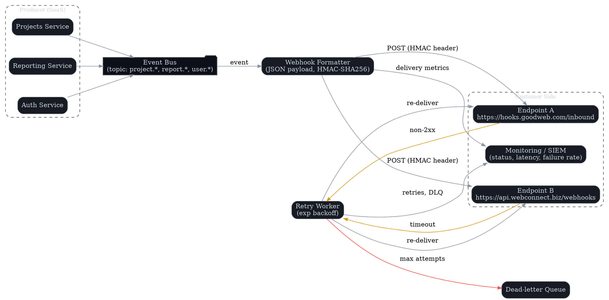

# Maintenance and Troubleshooting

**Author:** John Saysitall (portfolio sample)
**Version:** 0.1 — <update date here>

---

## Routine Maintenance

- [ ] Validate backup completion and integrity (weekly schedule)
- [ ] Execute test restoration procedures (monthly validation)
- [ ] Audit data retention policy compliance (quarterly review)
- [ ] Implement API key and secret rotation (annual cycle or upon compromise)

---

## Monitoring

- [ ] Monitor system health endpoints (`/health`, `/status`) for availability
- [ ] Centralize log aggregation through SIEM/ELK infrastructure
- [ ] Evaluate alerting thresholds for CPU, memory, latency, and error rates

Example health check:

```bash
curl -s https://api.cloudflow.goodweb.com/v1/health | jq
```



---

## Troubleshooting Playbooks

| Symptom            | Likely Cause        | Resolution |
|--------------------|---------------------|------------|
| Authentication loops | Identity provider misconfiguration | Validate ACS URL, certificate validity, system clock synchronization |
| Webhook delivery failures | Network connectivity or DNS issues | Verify firewall allowlists, DNS resolution, retry policy configuration |
| Slow report exports | Large dataset processing | Implement filtering, pagination, or asynchronous export processing |
| High API latency | Database query performance | Review query optimization, caching strategy, connection pooling |
| Memory consumption spikes | Resource leak or inefficient processing | Analyze heap dumps, optimize algorithms, implement garbage collection tuning |
