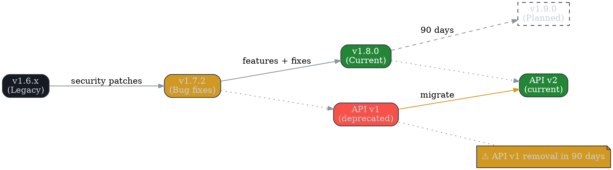

# Release Notes / Changelog Template

**Author:** John Saysitall (portfolio sample)
**Version:** 0.1 — <update date here>

---

## How to Use

- Maintain **task-oriented** and **impact-focused** entries.
- Prioritize *upgrade notes*, *breaking changes*, and *deprecations* prominently.
- Apply consistent categorization tags (✨ New, ⚡ Improved, 🐛 Fixed, 🛡️ Security).

---

## 2025-09-08 (v1.8.0)

### Highlights

- ✨ **New:** Project templates gallery with pre-configured workflows
- ⚡ **Improved:** Report generation performance enhanced by 30%
- 🛡️ **Security:** Mandatory SSO enforcement for administrator accounts

### Breaking Changes

- None in this release

### Details

- Introduced `/v2/reports` batch processing endpoint
- Enhanced CSV import validation messaging
- Resolved timezone inconsistencies in dashboard displays

### Upgrade Notes

- `GET /v1/reports` deprecated (removal in 90 days) → use `/v2/reports`

---

## 2025-08-15 (v1.7.2)

### Highlights

- 🐛 Critical bug fixes and stability improvements

### Details

- Eliminated duplicate activity feed notifications
- Resolved billing calculation precision errors
- Addressed XSS vulnerability in dashboard filter components

### Upgrade Notes

- No action required
