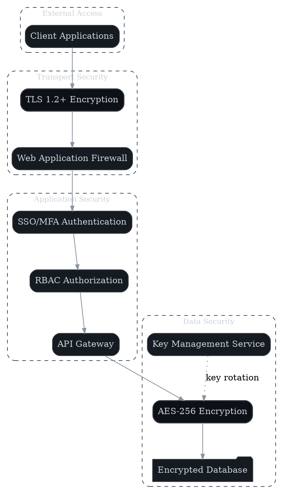

# Security & Compliance Overview

**Author:** John Saysitall (portfolio sample)
**Version:** 0.1 — <update date here>

---

## Trust Model & Responsibilities

- **Vendor responsibilities:** Application security, infrastructure hardening, incident response protocols
- **Customer responsibilities:** Identity provider configuration, user access governance, endpoint protection

---

## Identity & Access Management

- Single Sign-On integration (SAML/OIDC protocols)
- Multi-Factor Authentication with conditional enforcement
- Role-Based Access Control implementing least privilege principles

---

## Data Protection

- **In transit:** TLS 1.2+ encryption for all network communications
- **At rest:** AES-256 encryption for databases and object storage systems
- **Key management:** Automated 12-month rotation cycles via dedicated KMS
- **Data residency:** Configurable EU/US regional data localization

---

## Compliance

- SOC 2 Type II certification with annual renewals
- ISO/IEC 27001 information security management certification
- GDPR-compliant Data Processing Addendum available
- Comprehensive audit trails with JSON/CSV export capabilities

Example audit log:

```json
{
  "timestamp": "2025-09-08T12:45:33Z",
  "user": "alice@example.com",
  "action": "ROLE_CHANGE",
  "target": "project:12345",
  "old_role": "viewer",
  "new_role": "admin"
}
```

---

## Secure SDLC Practices

- Comprehensive threat modeling integrated into design phases
- Automated SAST and dependency vulnerability scanning
- Annual third-party penetration testing assessments
- Secure CI/CD pipelines with cryptographically signed artifacts



---

## Incident Response

- **Response framework:** Containment, investigation, remediation, and communication protocols
- **Notification requirements:**
  - Regulatory compliance within 72 hours (GDPR mandates)
  - Customer breach notification within 24 hours of confirmation
- **RACI accountability:** Defined ownership across Operations, Security, Legal, and Communications teams
