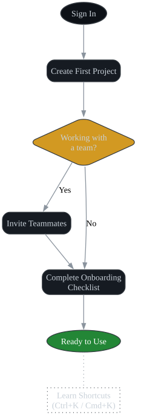

# CloudFlow Pro User Manual

**Author:** John Saysitall  
**Version:** 2.1 — December 2024  
**Product Version:** CloudFlow Pro 3.4.2

---

## About This Manual

- **Product name**: _CloudFlow Pro_ by Goodweb, Inc. (fictional SaaS product for demonstration)
- **Audience**: End-users, project managers, and workspace administrators
- **Prerequisites**: Active account with workspace access, modern web browser (Chrome 90+, Firefox 88+, Safari 14+)
- **Supported platforms**: Web application, CLI tools, REST API integration

---

## Quick Start Guide

### Initial Setup

1. **Account Activation**
   - Navigate to https://cloudflow.goodweb.com
   - Complete email verification using the activation link
   - Set up two-factor authentication (recommended)

2. **Workspace Configuration**
   ```bash
   # CLI setup (optional)
   npm install -g @cloudflow/cli
   cloudflow login --workspace=your-org
   cloudflow config set default-project "getting-started"
   ```

3. **First Project Creation**
   - Dashboard → **New Project** → Select template
   - Configure project settings and team permissions
   - Import existing data (CSV, JSON, or API sync)



---

## Core Features

### Project Management

#### Creating Projects

Projects serve as containers for related tasks and team collaboration:

| Project Template | Use Case | Default Features |
|------------------|----------|-----------------|
| **Agile Sprint** | Software development | Story points, burndown charts, sprint planning |
| **Marketing Campaign** | Content and promotion | Asset library, campaign timeline, ROI tracking |
| **Event Planning** | Conference, meetings | Vendor management, budget tracking, attendee lists |
| **General Purpose** | Custom workflows | Basic tasks, milestones, document sharing |

**Step-by-step project creation:**

1. Access **Projects** → **New Project**
2. Choose template or start blank
3. Configure basic settings:
   ```
   Project Name: Q1 Product Launch
   Description: Mobile app v2.0 release preparation
   Team Size: 8-12 members
   Timeline: 90 days
   Budget: $150,000
   ```
4. Set team permissions and notification preferences
5. Import initial task list or create from template

#### Project Settings Configuration

Access **Project Settings** → **General** for advanced configuration:

```bash
# CLI project configuration
cloudflow project create "Q1-Product-Launch" \
  --template=agile \
  --team-size=10 \
  --duration=90d \
  --budget=150000

# Set project-specific preferences
cloudflow project config set notifications.daily_digest=true
cloudflow project config set integrations.slack_channel="#product-team"
cloudflow project config set reporting.auto_export="weekly"
```

### Task Management

#### Task Creation and Configuration

Tasks are the fundamental work units in CloudFlow Pro:

**Task Properties:**

| Field | Type | Required | Description |
|-------|------|----------|-------------|
| **Title** | Text (100 chars) | ✓ | Brief task description |
| **Description** | Rich text | ✗ | Detailed specifications |
| **Assignee** | User reference | ✓ | Responsible team member |
| **Priority** | Low/Medium/High/Critical | ✓ | Impact and urgency level |
| **Due Date** | DateTime | ✗ | Target completion |
| **Estimated Hours** | Numeric | ✗ | Time allocation |
| **Tags** | Array | ✗ | Categorization labels |
| **Dependencies** | Task references | ✗ | Blocking relationships |

**Creating tasks via web interface:**

1. Navigate to project workspace
2. Click **+ New Task** button
3. Fill required fields:
   ```
   Title: Implement user authentication API
   Assignee: sarah.developer@company.com
   Priority: High
   Due Date: 2024-12-20
   Estimated Hours: 16
   Tags: backend, security, api
   ```

**Creating tasks via CLI:**

```bash
# Basic task creation
cloudflow task create \
  --title "Implement user authentication API" \
  --assignee "sarah.developer@company.com" \
  --priority high \
  --due "2024-12-20" \
  --estimate 16h \
  --tags "backend,security,api"

# Task with dependencies
cloudflow task create \
  --title "Deploy authentication to staging" \
  --depends-on TASK-123 \
  --assignee "devops@company.com"

# Bulk task creation from CSV
cloudflow task import --file tasks.csv --project "Q1-Product-Launch"
```

**Sample CSV format for bulk import:**
```csv
title,assignee,priority,due_date,estimate_hours,tags,description
"Design login UI","ui.designer@company.com","Medium","2024-12-15",8,"frontend,design","Create mockups for authentication screens"
"Write API documentation","tech.writer@company.com","Low","2024-12-25",4,"documentation,api","Document authentication endpoints"
"Set up monitoring","devops@company.com","High","2024-12-18",12,"infrastructure,monitoring","Configure alerts for auth service"
```

#### Task Status Management

CloudFlow Pro uses a customizable workflow with default states:

| Status | Description | Automated Actions |
|--------|-------------|------------------|
| **Backlog** | Awaiting assignment | No notifications |
| **In Progress** | Active development | Daily standup inclusion |
| **Code Review** | Pending peer review | Reviewer notifications |
| **Testing** | QA validation | Test assignment alerts |
| **Staging** | Production-ready | Deployment eligibility |
| **Done** | Completed work | Time tracking closure |
| **Blocked** | External dependency | Escalation notifications |

**Status transitions via CLI:**
```bash
# Update single task status
cloudflow task update TASK-123 --status "in-progress"

# Bulk status updates with filters
cloudflow task update --assignee "sarah.developer@company.com" \
  --current-status "backlog" \
  --new-status "in-progress"

# Add blocking reason
cloudflow task update TASK-456 --status "blocked" \
  --reason "Waiting for API specification approval"
```

### Team Collaboration

#### User Roles and Permissions

CloudFlow Pro implements role-based access control:

| Role | Project Access | Task Management | Admin Functions | API Access |
|------|----------------|-----------------|----------------|------------|
| **Viewer** | Read-only | View tasks | None | Read-only endpoints |
| **Member** | Full access | Create/edit own | None | Standard CRUD |
| **Lead** | Full access | Manage all tasks | Project settings | Extended permissions |
| **Admin** | All projects | Full management | User management | Administrative API |

**Managing team members:**

```bash
# Invite new team member
cloudflow team invite user@company.com \
  --role member \
  --projects "Q1-Product-Launch,Q2-Planning"

# Update user permissions
cloudflow team update-role user@company.com --role lead

# List team members with roles
cloudflow team list --format table
```

**Sample team management output:**
```
┌─────────────────────────┬────────────┬──────────────┬─────────────┐
│ Email                   │ Role       │ Last Active  │ Projects    │
├─────────────────────────┼────────────┼──────────────┼─────────────┤
│ sarah.dev@company.com   │ Lead       │ 2 hours ago  │ 3 active    │
│ mike.pm@company.com     │ Member     │ 1 day ago    │ 5 active    │
│ anna.qa@company.com     │ Member     │ 4 hours ago  │ 2 active    │
│ john.admin@company.com  │ Admin      │ 30 min ago   │ All         │
└─────────────────────────┴────────────┴──────────────┴─────────────┘
```

#### Communication and Notifications

**Comment System:**

Tasks include threaded comments for collaboration:

```bash
# Add comment to task
cloudflow task comment TASK-123 \
  --message "Updated API endpoint to use OAuth 2.0" \
  --mention "@mike.pm@company.com"

# List recent comments
cloudflow task comments TASK-123 --since "2024-12-01"
```

**Notification Preferences:**

| Notification Type | Email | In-app | Slack | Teams |
|------------------|-------|--------|-------|-------|
| Task assigned | ✓ | ✓ | ✓ | ✗ |
| Due date approaching | ✓ | ✓ | ✗ | ✗ |
| Status changed | ✗ | ✓ | ✓ | ✓ |
| Comments added | ✗ | ✓ | ✓ | ✗ |
| Project milestones | ✓ | ✓ | ✓ | ✓ |

Configure notifications via **Settings** → **Notifications** or CLI:

```bash
cloudflow user config set notifications.email.task_assigned=true
cloudflow user config set notifications.slack.status_changes=true
cloudflow user config set notifications.digest_frequency="daily"
```

### Reporting and Analytics

#### Dashboard Overview

The main dashboard provides real-time project metrics:

**Key Performance Indicators:**

| Metric | Calculation | Benchmark |
|--------|-------------|-----------|
| **Velocity** | Story points/sprint | Team average ±20% |
| **Burndown Rate** | Tasks completed/day | Project timeline adherence |
| **Cycle Time** | Average task duration | Historical comparison |
| **Team Utilization** | Active tasks/team size | 80-90% optimal |
| **Quality Score** | (Passed tests)/(Total tests) | >95% target |

**Generating reports via CLI:**

```bash
# Project summary report
cloudflow report generate --type summary \
  --project "Q1-Product-Launch" \
  --period "last-30-days" \
  --format pdf \
  --output "reports/project-summary-dec2024.pdf"

# Team performance analytics
cloudflow report generate --type team-performance \
  --include-charts \
  --format html \
  --email-to "stakeholders@company.com"

# Custom report with specific metrics
cloudflow report custom \
  --metrics "velocity,burndown,cycle_time" \
  --filters "priority:high,status:done" \
  --groupby assignee \
  --export csv
```

**Sample report output:**
```
Project: Q1 Product Launch
Period: November 1-30, 2024
Total Tasks: 127 | Completed: 89 | Remaining: 38

Team Performance:
┌──────────────────┬───────────┬─────────────┬──────────────┬─────────────┐
│ Team Member      │ Assigned  │ Completed   │ Avg Duration │ Quality     │
├──────────────────┼───────────┼─────────────┼──────────────┼─────────────┤
│ Sarah Developer  │ 23        │ 21 (91%)    │ 2.3 days     │ 97%         │
│ Mike PM          │ 15        │ 14 (93%)    │ 1.8 days     │ 100%        │
│ Anna QA          │ 18        │ 16 (89%)    │ 3.1 days     │ 94%         │
└──────────────────┴───────────┴─────────────┴──────────────┴─────────────┘
```

### Advanced Features

#### API Integration

CloudFlow Pro provides comprehensive REST API access:

**Authentication:**
```bash
# Generate API token
cloudflow auth token create --name "ci-cd-integration" --scope "projects:read,tasks:write"

# Configure API access
export CLOUDFLOW_API_TOKEN="cf_live_1234567890abcdef"
export CLOUDFLOW_API_URL="https://api.cloudflow.goodweb.com/v2"
```

**Common API operations:**

```bash
# Fetch project data
curl -H "Authorization: Bearer $CLOUDFLOW_API_TOKEN" \
     -H "Content-Type: application/json" \
     "$CLOUDFLOW_API_URL/projects/Q1-Product-Launch/tasks?status=in-progress"

# Create task via API
curl -X POST \
     -H "Authorization: Bearer $CLOUDFLOW_API_TOKEN" \
     -H "Content-Type: application/json" \
     -d '{
       "title": "Fix authentication bug",
       "assignee": "sarah.developer@company.com",
       "priority": "high",
       "tags": ["bugfix", "security"]
     }' \
     "$CLOUDFLOW_API_URL/projects/Q1-Product-Launch/tasks"

# Bulk status update via API
curl -X PATCH \
     -H "Authorization: Bearer $CLOUDFLOW_API_TOKEN" \
     -H "Content-Type: application/json" \
     -d '{
       "filter": {"assignee": "sarah.developer@company.com", "status": "code-review"},
       "update": {"status": "testing"}
     }' \
     "$CLOUDFLOW_API_URL/tasks/bulk-update"
```

#### Webhook Configuration

Set up real-time notifications for external systems:

```bash
# Create webhook endpoint
cloudflow webhook create \
  --url "https://your-app.com/cloudflow-webhook" \
  --events "task.created,task.completed,project.milestone" \
  --secret "your-webhook-secret"

# Test webhook delivery
cloudflow webhook test --endpoint webhook-123 --event task.created

# List active webhooks
cloudflow webhook list --format table
```

**Sample webhook payload:**
```json
{
  "event": "task.completed",
  "timestamp": "2024-12-10T14:30:00Z",
  "workspace": "goodweb-engineering",
  "project": "Q1-Product-Launch",
  "data": {
    "task_id": "TASK-123",
    "title": "Implement user authentication API",
    "assignee": "sarah.developer@company.com",
    "completed_at": "2024-12-10T14:29:45Z",
    "duration_hours": 14.5
  }
}
```

#### Data Import/Export

**Supported formats:**

| Format | Import | Export | Use Case |
|--------|--------|--------|----------|
| **CSV** | ✓ | ✓ | Bulk task management, reporting |
| **JSON** | ✓ | ✓ | API integration, backups |
| **Excel** | ✓ | ✓ | Stakeholder reports, planning |
| **PDF** | ✗ | ✓ | Executive summaries, archives |
| **XML** | ✓ | ✗ | Legacy system integration |

**Import operations:**

```bash
# Import tasks from CSV
cloudflow import tasks \
  --file "project-tasks.csv" \
  --project "Q1-Product-Launch" \
  --skip-validation=false \
  --dry-run

# Import project structure from JSON
cloudflow import project \
  --file "project-template.json" \
  --create-users=true \
  --send-invites=false

# Import from external system
cloudflow import external \
  --source jira \
  --project-key "PROJ" \
  --mapping-file "jira-cloudflow-mapping.json"
```

**Export operations:**

```bash
# Export all project data
cloudflow export project "Q1-Product-Launch" \
  --format json \
  --include-comments \
  --include-attachments \
  --output "backup-q1-launch.json"

# Export specific task data for analysis
cloudflow export tasks \
  --filter "priority:high,status:done" \
  --format csv \
  --fields "title,assignee,created_at,completed_at,duration" \
  --output "high-priority-completed.csv"
```

---

## Keyboard Shortcuts

Improve efficiency with built-in keyboard shortcuts:

| Action | Windows/Linux | macOS | Description |
|--------|---------------|-------|-------------|
| **Global Search** | `Ctrl + K` | `Cmd + K` | Search tasks, projects, users |
| **Quick Task** | `Ctrl + N` | `Cmd + N` | Create new task |
| **Navigation** | `Ctrl + 1-9` | `Cmd + 1-9` | Switch between main sections |
| **Command Palette** | `Ctrl + Shift + P` | `Cmd + Shift + P` | Access all commands |
| **Focus Mode** | `F11` | `Cmd + Ctrl + F` | Hide navigation sidebar |
| **Refresh Data** | `F5` | `Cmd + R` | Reload current view |
| **Bulk Select** | `Ctrl + Click` | `Cmd + Click` | Multi-select tasks |
| **Mark Complete** | `Ctrl + Enter` | `Cmd + Enter` | Complete selected tasks |

---

## Troubleshooting

### Common Issues and Solutions

#### Performance Issues

**Slow dashboard loading:**
```bash
# Clear local cache
cloudflow cache clear --all

# Check system status
cloudflow status --include-performance

# Optimize workspace settings
cloudflow workspace optimize --project "Q1-Product-Launch"
```

**Large dataset handling:**
```bash
# Enable pagination for large task lists
cloudflow config set ui.pagination.enabled=true
cloudflow config set ui.pagination.size=50

# Use filters to reduce data load
cloudflow tasks list --limit 100 --status "in-progress,testing"
```

#### Authentication Problems

**Token expiration:**
```bash
# Refresh authentication token
cloudflow auth refresh

# Check token validity
cloudflow auth verify --token $CLOUDFLOW_API_TOKEN

# Generate new long-term token
cloudflow auth token create --name "backup-token" --expires-in "90d"
```

**SSO integration issues:**
```bash
# Test SAML configuration
cloudflow auth test-saml --provider okta

# Check SCIM sync status
cloudflow users sync-status --provider azure-ad

# Manual user sync
cloudflow users sync --dry-run
```

#### Data Sync Issues

**Missing tasks or outdated information:**
```bash
# Force data synchronization
cloudflow sync --force --project "Q1-Product-Launch"

# Check sync conflicts
cloudflow sync conflicts --resolve-strategy "server-wins"

# Verify data integrity
cloudflow validate --project "Q1-Product-Launch" --fix-errors
```

### Error Codes Reference

| Code | Category | Description | Resolution |
|------|----------|-------------|------------|
| **CF001** | Authentication | Invalid API token | Refresh or regenerate token |
| **CF002** | Authorization | Insufficient permissions | Contact workspace admin |
| **CF003** | Rate Limiting | API quota exceeded | Wait or upgrade plan |
| **CF004** | Validation | Invalid task data | Check required fields |
| **CF005** | System | Service unavailable | Check status.goodweb.com |

### Support Contacts

For additional assistance:

- **Knowledge Base:** https://help.cloudflow.goodweb.com
- **Community Forum:** https://community.cloudflow.goodweb.com  
- **Technical Support:** support@goodweb.com (24/7 for Pro customers)
- **Status Updates:** https://status.goodweb.com
- **Feature Requests:** features@goodweb.com

**Enterprise Support:**
- **Dedicated Support Manager:** Available for Enterprise plans
- **Phone Support:** 1-800-CLOUDFLOW (Enterprise only)
- **SLA Response Times:** 1 hour (Critical), 4 hours (High), 24 hours (Standard)

---

## Glossary

- **Workspace** — Top-level organizational container managing projects and users
- **Project** — Collection of related tasks, milestones, and team members
- **Task** — Individual work item with assignee, status, and metadata
- **Sprint** — Time-boxed iteration for agile project management
- **Milestone** — Significant project checkpoint or deliverable
- **Burndown** — Visual representation of work remaining over time
- **Velocity** — Team's rate of task completion over time
- **Cycle Time** — Average duration from task start to completion
- **Admin** — User role with elevated workspace and user management permissions
- **API Token** — Authentication credential for programmatic access
- **Webhook** — HTTP callback for real-time event notifications

---

*CloudFlow Pro and Goodweb, Inc. are fictional entities created for portfolio demonstration purposes. All features, URLs, and contact information are imaginary.*