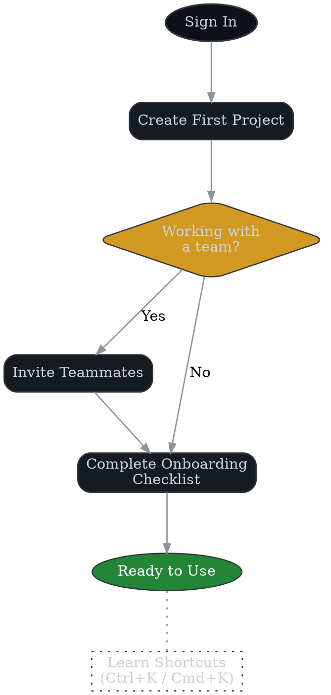

# Product User Manual (SaaS)

**Author:** Koray Erkan (portfolio sample)
**Version:** 0.1 — <update date here>

---

## About This Manual

- **Product name**: _ACME Cloud_ (fictional SaaS product for demonstration)
- **Audience**: End-users and workspace administrators
- **Assumptions**: Active account with workspace access and modern web browser

---

## Getting Started

1. **Sign in**
   Navigate to https://acmecloud.example and authenticate with your credentials.
   

2. **Create your first project**
   From the dashboard, select **New Project**. Provide a descriptive name and optional details.

3. **Invite teammates**
   Use the **Invite** function to add collaborators via email addresses.

4. **Complete onboarding checklist**
   Follow the guided setup wizard to configure essential workspace preferences.

> 💡 **Tip:** Bookmark the dashboard for faster access.

---

## Core Workflows

### Create & Assign Tasks

1. Access your project workspace.
2. Select **+ Task** and define title, description, and deadline.
3. Assign ownership to a team member.
4. Confirm creation.

### Track Progress & Dashboards

- Access **Dashboards** via primary navigation.
- Apply filters by **status**, **assignee**, and **priority**.
- Generate CSV or PDF reports for stakeholder distribution.

---

## Tips & Shortcuts

- Press `Ctrl + K` (Windows) / `Cmd + K` (Mac) for universal search.
- Leverage **saved views** for standardized reporting.
- Perform bulk operations by multi-selecting task rows.

---

## FAQs

**Q: Can I reset my password without contacting support?**
A: Yes. Use **Forgot Password** on the sign-in page.

**Q: How do I change my workspace name?**
A: Go to **Settings → Workspace → General**.

**Q: Is there a mobile app?**
A: Not yet, but the web app is fully responsive.

---

## Glossary

- **Workspace** — A shared environment containing projects and users.
- **Project** — A collection of tasks, milestones, and dashboards.
- **Admin** — A role with elevated permissions (invite/manage users, configure settings).
