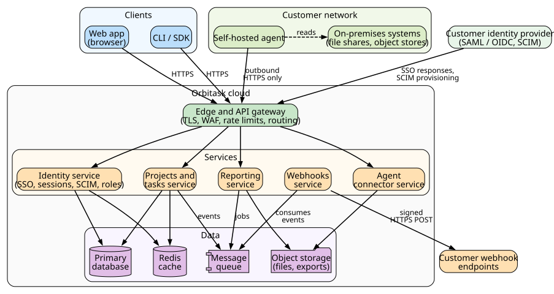

# Conceptual Architecture Overview

**Author:** John Saysitall  
**Version:** Orbitask 1.8.0 · August 2026

---

## High-level architecture

| Component | What it does |
|-----------|--------------|
| **Web app, CLI/SDK** | Clients that call the API at `api.orbitask.example`. The web app is served from `app.orbitask.example`. |
| **Self-hosted agent** | Optional service in the customer network. It makes outbound HTTPS connections only, to `agent.orbitask.example`. See [Installation & Setup](installation-setup-guide.md#optional-self-hosted-agent). |
| **Identity provider (IdP)** | The customer's SAML or OIDC provider. It authenticates users and, through SCIM, creates and removes accounts. |
| **Edge and API gateway** | Terminates TLS, filters traffic (WAF), applies rate limits, and routes requests. |
| **Identity service** | Handles SSO sign-in, sessions, API tokens, SCIM provisioning, and role checks. |
| **Projects and tasks service** | Owns workspaces, projects, tasks, comments, and activity history. |
| **Reporting service** | Builds dashboards and exports; long exports run as background jobs. |
| **Webhooks service** | Signs and delivers event notifications, with retries. See [Webhook configuration](user-manual.md#webhook-configuration). |
| **Primary database** | System of record for workspace data. |
| **Redis cache** | Caches frequent reads such as dashboards and permission lookups. |
| **Message queue** | Carries background jobs (reports, imports) and events for webhooks. |
| **Object storage** | Stores attachments, imports, and generated exports. |

---

## Data model

- **Workspace**: The top-level container for projects, members, roles, and settings.
- **Project**: A unit of work that contains tasks, milestones, and dashboards. Access is inherited from the workspace.
- **Task**: An item of work with a status, optional assignee, due date, and priority.
- **User**: A person who signs in (through SSO or email) and holds one role per workspace. See [Roles and permissions](user-manual.md#roles-and-permissions).

---

## Integration points

- **REST API (v2)**: Create, read, update, and delete operations, plus bulk updates and batch reports. API v1 is deprecated; see [Release Notes](release-notes.md#deprecations).
- **Webhooks**: Signed notifications when tasks, projects, and members are created, updated, or deleted.
- **Data import**: CSV uploads and connectors for S3-compatible object storage.
- **Identity**: SAML 2.0 or OIDC single sign-on; SCIM 2.0 provisioning.

---

## Performance and scaling

- Reads that repeat often, such as dashboards, are served from the Redis cache.
- Reports, imports, and notifications run asynchronously through the message queue.
- Each API token can make up to 1,000 requests per minute. See [API errors and rate limits](maintenance-troubleshooting.md#api-errors-and-rate-limits).
- Write endpoints accept an `Idempotency-Key` header, so retried requests do not create duplicates.

---

## Limits and roadmap

- **Users:** Up to 10,000 users per workspace. Larger organizations use several workspaces under an Enterprise plan.
- **Files:** 100 MB maximum per uploaded file.
- **SCIM:** Generally available for Okta; Microsoft Entra ID provisioning is in preview. (Single sign-on with Entra ID is fully supported.)
- **Roadmap:** Multi-region data replication.
