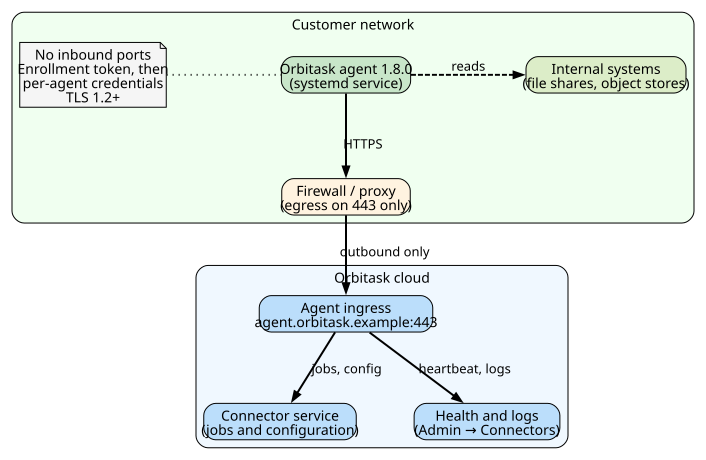
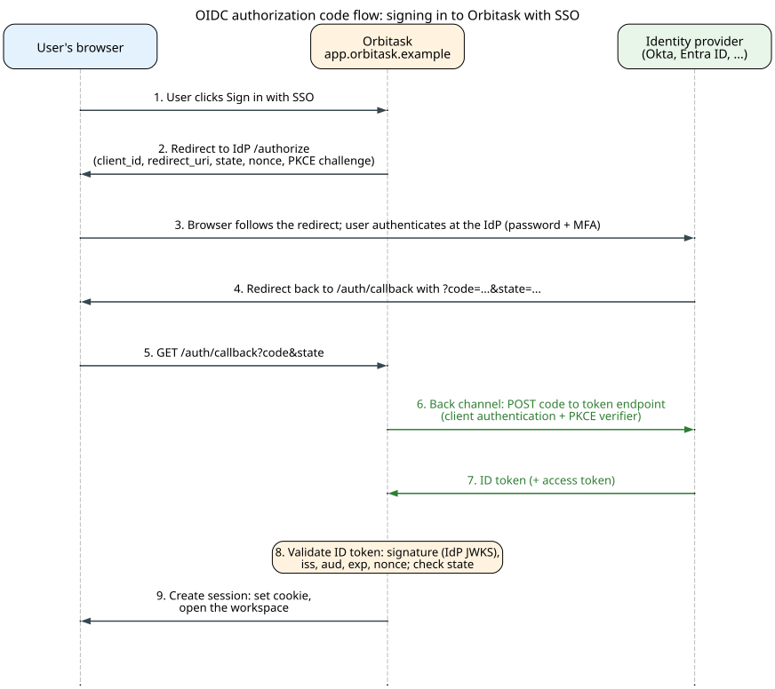

# Installation and Setup Guide

**Author:** John Saysitall  
**Version:** Orbitask 1.8.0 · August 2026

> **Purpose**
> Set up an Orbitask workspace for the first time. Audience: workspace Owners and IT administrators. Scope: prerequisites, workspace setup, the optional self-hosted agent, SSO and SCIM, validation, and rollback.

---

## Prerequisites

| Category | Requirement | Notes |
|----------|-------------|-------|
| Identity provider | SAML 2.0 or OpenID Connect | Okta, Microsoft Entra ID (formerly Azure AD), and Google Workspace are supported |
| Network | HTTPS (443) egress to `*.orbitask.example` | Add the domain to your firewall or proxy allowlist |
| Browser | Latest two versions of Chrome, Edge, Firefox, or Safari | Cookies and local storage must be enabled |
| Access | Workspace **Owner** role | Required for SSO, SCIM, domain verification, and billing. See [Roles and permissions](user-manual.md#roles-and-permissions) |
| Agent host (optional) | Linux x86_64: Ubuntu 22.04 or 24.04 LTS, or RHEL 8 or 9, with systemd | Minimum 2 vCPU, 4 GB RAM, 10 GB free disk |
| Agent network (optional) | Outbound HTTPS (443) to `agent.orbitask.example` and `downloads.orbitask.example` | No inbound ports are needed |

---

## Set up your workspace

1. **Create the workspace.**
   Go to `https://app.orbitask.example/signup` and sign up with your work email. You become the workspace Owner.
2. **Verify your domain.**
   In **Admin → Domains**, copy the TXT record, add it to your DNS zone, and click **Verify**.
   *Result:* The domain shows **Verified**. DNS changes can take up to an hour to appear.
3. **Set up billing (optional during the trial).**
   In **Admin → Billing**, choose a plan, add a payment method, and enter the invoice recipient.
4. **Set workspace defaults.**
   In **Admin → General**, set the workspace name, default time zone, and data region (EU or US). The data region cannot be changed later.

---

## Optional: Self-hosted agent

Install the agent only if Orbitask needs to reach systems inside your network, such as an on-premises file share or a private object store. The agent connects outbound to Orbitask; nothing connects in.



### Install the agent

Run these steps on the agent host as a user with `sudo` rights. The agent version matches the platform release: **1.8.0**.

1. Download the agent archive and its checksum file:

   ```bash
   VERSION=1.8.0
   BASE=https://downloads.orbitask.example/agent/$VERSION
   curl -fsSLO "$BASE/orbitask-agent_${VERSION}_linux_amd64.tar.gz"
   curl -fsSLO "$BASE/orbitask-agent_${VERSION}_linux_amd64.tar.gz.sha256"
   ```

2. Verify the download:

   ```bash
   sha256sum -c "orbitask-agent_${VERSION}_linux_amd64.tar.gz.sha256"
   ```

   *Result:* `orbitask-agent_1.8.0_linux_amd64.tar.gz: OK`. If you see `FAILED`, delete the files and download them again. Do not install a file that fails the check.

3. Unpack the archive and install the binary and its systemd unit:

   ```bash
   tar -xzf "orbitask-agent_${VERSION}_linux_amd64.tar.gz"
   sudo useradd --system --no-create-home --shell /usr/sbin/nologin orbitask-agent
   sudo install -m 0755 orbitask-agent /usr/local/bin/orbitask-agent
   sudo install -m 0644 orbitask-agent.service /etc/systemd/system/orbitask-agent.service
   sudo systemctl daemon-reload
   ```

   The unit file in the archive looks like this:

   ```ini
   [Unit]
   Description=Orbitask agent
   After=network-online.target
   Wants=network-online.target

   [Service]
   User=orbitask-agent
   ExecStart=/usr/local/bin/orbitask-agent run --config /etc/orbitask-agent/agent.yaml
   Restart=on-failure
   RestartSec=5

   [Install]
   WantedBy=multi-user.target
   ```

4. In the web app, go to **Admin → Connectors → Add agent** and copy the enrollment token. The token works once and expires after 24 hours.

5. Enroll the agent with the token:

   ```bash
   sudo orbitask-agent enroll --token <TOKEN>
   ```

   *Result:* The command writes `/etc/orbitask-agent/agent.yaml` and the agent credentials, owned by the `orbitask-agent` user, and prints `Enrolled as agent <AGENT-ID>`.

6. Start the service and make it start at boot:

   ```bash
   sudo systemctl enable --now orbitask-agent
   ```

### Check the agent's health

On the agent host, run:

```bash
orbitask-agent status
```

A healthy agent reports:

```text
Agent:      1.8.0
Service:    running
Enrolled:   yes (workspace acme-eng)
Connection: connected to agent.orbitask.example:443 (last heartbeat 4s ago)
```

In the web app, **Admin → Connectors** shows the agent as **Healthy** within a minute. If it does not, see [Agent troubleshooting](maintenance-troubleshooting.md#agent-troubleshooting).

---

## Configuration

### Single sign-on (SAML or OIDC)

1. In **Admin → Security → Single sign-on**, choose **SAML 2.0** or **OpenID Connect**.
2. In your identity provider, create an application with these values:

   | Protocol | Setting | Value |
   |----------|---------|-------|
   | OIDC | Redirect URI | `https://app.orbitask.example/auth/callback` |
   | SAML | ACS URL | `https://app.orbitask.example/auth/saml/acs` |
   | SAML | Entity ID (audience) | `https://app.orbitask.example/saml/metadata` |

3. Back in Orbitask, upload the IdP metadata (SAML) or enter the issuer URL, client ID, and client secret (OIDC).
4. Test with a pilot group before you turn on **Require SSO**.

The OIDC sign-in uses the authorization code flow:



### SCIM provisioning

SCIM is generally available for Okta and in preview for Microsoft Entra ID.

1. In **Admin → Security → Provisioning**, click **Enable SCIM** and copy the base URL and bearer token.
2. In your identity provider, enter the base URL and token.
3. Map IdP groups to Orbitask roles (Owner, Admin, Member, Viewer).
4. Sync one small group and check that its members appear in **Admin → Members** with the expected roles before you sync everyone.

### API tokens and webhooks

- **API tokens:** Create tokens in **Settings → API tokens** with only the scopes the integration needs. A token can never do more than the role of the user who created it.
- **Webhooks:** Add endpoints in **Admin → Webhooks**. Your endpoint must verify each request's signature and return a 2xx response within 10 seconds. See [Webhook configuration](user-manual.md#webhook-configuration).

---

## Validation checklist

- [ ] A pilot user signs in through SSO.
- [ ] You can create a workspace project.
- [ ] An invited teammate receives the invitation and signs in.
- [ ] You can create and assign a task, and it appears in the project's activity log.
- [ ] A CSV report export opens with correct data and time zone.
- [ ] (If you installed the agent) **Admin → Connectors** shows the agent as **Healthy**.

---

## Troubleshooting setup

| Symptom | Likely cause | What to do |
|---------|--------------|------------|
| SSO sign-in loops back to the sign-in page | Redirect URI, ACS URL, or audience does not match; clock drift of more than 5 minutes | Compare the IdP values with the table above; make sure the IdP and your devices use NTP |
| User signs in but sees no projects | No role mapped to the user's IdP group | Map the group to a role in **Admin → Security → Provisioning**, then click **Sync now** |
| Webhook test fails | A firewall blocks Orbitask, or the endpoint returns a non-2xx status | Allow inbound HTTPS from Orbitask to the endpoint; check the delivery log in **Admin → Webhooks** |
| Agent shows **Offline** | Egress to `agent.orbitask.example` blocked, or enrollment token expired | Run `orbitask-agent status`; generate a new token and enroll again if needed |

For more, see [Maintenance & Troubleshooting](maintenance-troubleshooting.md).

---

## Rollback

1. Export your workspace data and confirm that the export is complete before you change anything. See [Export your data](maintenance-troubleshooting.md#export-your-data).
2. Turn off **Require SSO**, so users can sign in with email again.
3. Turn off SCIM provisioning in **Admin → Security → Provisioning**.
4. Stop and remove the agent: `sudo systemctl disable --now orbitask-agent`, then delete `/usr/local/bin/orbitask-agent`, `/etc/systemd/system/orbitask-agent.service`, and `/etc/orbitask-agent/`. Remove it from **Admin → Connectors**.
5. If you are closing the workspace, remove the DNS TXT verification record last.
