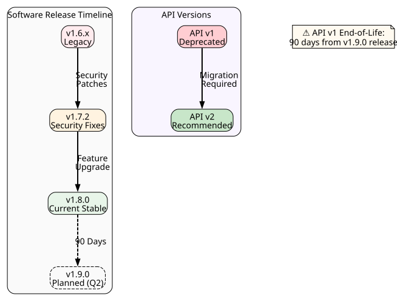

# Release Notes

**Author:** John Saysitall  
**Version:** Orbitask 1.8.0 · August 2026

Orbitask updates the cloud service automatically. Actions you may need to take, such as updating self-hosted agents or moving off deprecated APIs, are listed under **What you need to do** in each release.

---

## 1.8.0 (2026-08-18)

### Highlights

- **API v2 covers every endpoint.** The last v1-only endpoints, including reports, now have v2 versions. `/v2/reports` also adds batch report generation.
- **Project templates gallery.** Start projects from ready-made templates such as Agile sprint and Event planning.
- **Faster reports.** Large reports generate about 30% faster.
- **SSO required for Admins and Owners.** When **Require SSO** is on, Admins and Owners must also sign in through SSO. An Owner can still use the emergency sign-in described in [SSO and SCIM issues](maintenance-troubleshooting.md#sso-and-scim-issues).
- **SCIM for Microsoft Entra ID (preview).** Provision users and groups from Entra ID. Single sign-on with Entra ID was already supported.

### Deprecations

- **API v1 is deprecated.** It stops working on **2026-11-16**, 90 days after this release. After that date, v1 requests return `410 Gone` (error `ORB006`).
  Until then, v1 responses include `Deprecation` and `Sunset` headers.

| v1 endpoint | Replace with |
|-------------|--------------|
| `GET /v1/projects` | `GET /v2/projects` |
| `GET /v1/projects/{id}/tasks` | `GET /v2/projects/{id}/tasks` |
| `POST /v1/tasks` | `POST /v2/projects/{id}/tasks` |
| `GET /v1/reports` | `GET /v2/reports` |
| `GET /v1/health` | `GET /v2/health` |

### Other changes

- Webhook payloads now include an `id` field. Use it to skip events delivered more than once. See [Webhook configuration](user-manual.md#webhook-configuration).
- CSV import errors now name the row and column that failed.
- **Fixed:** Dashboards showed some due dates in UTC instead of the workspace time zone.
- **Agent 1.8.0:** Adds `orbitask-agent check-connectivity`, which reports the first failing step (DNS, proxy, TLS, or authentication).

### Breaking changes

None.

### What you need to do

1. Find integrations that still call API v1: **Admin → Workspace health → API v1 calls**. Move them to v2 before 2026-11-16.
2. Update self-hosted agents to 1.8.0 within 30 days. Agents 1.7.x keep working. See [Update the agent](maintenance-troubleshooting.md#update-the-agent).
3. If your webhook endpoints de-duplicate events another way, switch to the new `id` field.

---

## 1.7.2 (2026-07-21)

### Fixes

- **Security:** Fixed a cross-site scripting (XSS) issue in dashboard filters. No customer action is needed.
- Activity feeds no longer show duplicate notifications.
- Fixed rounding errors in prorated invoice amounts.

### What you need to do

Nothing.

---

## 1.7.0 (2026-06-16)

### Highlights

- **Webhook redelivery.** Redeliver failed events from **Admin → Webhooks → Deliveries** or with `orbitask webhook redeliver`.
- **Workspace health page.** One page in **Admin → Workspace health** shows API latency, webhook success, agent status, and SCIM sync status.
- **Agent 1.7.0:** Supports RHEL 9 and Ubuntu 24.04 LTS.

### What you need to do

Update self-hosted agents to 1.7.0 or later. Agents older than 1.7.0 are no longer supported from 2026-09-30.
