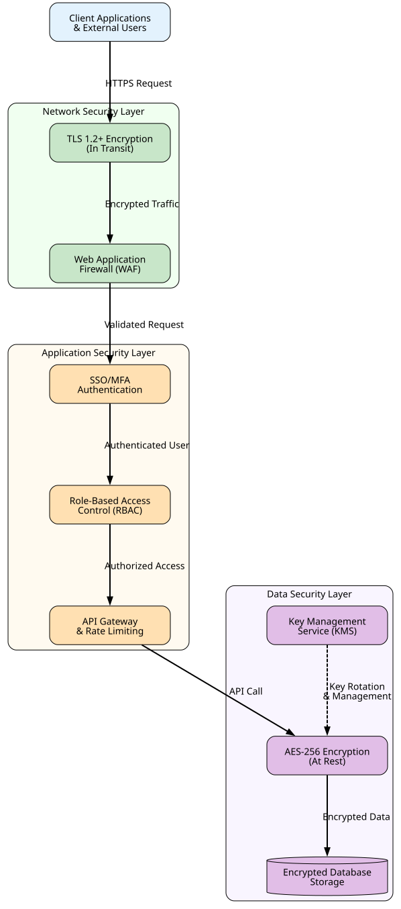

# Security and Compliance Overview

**Author:** John Saysitall  
**Version:** Orbitask 1.8.0 · August 2026

---

## Shared responsibilities

| Orbitask is responsible for | You are responsible for |
|-----------------------------|-------------------------|
| Security of the application and infrastructure | Configuring your identity provider, SSO, and MFA |
| Encryption in transit and at rest | Deciding who gets which role, and removing leavers |
| Service backups, monitoring, and incident response | Protecting API tokens, webhook secrets, and devices |
| Keeping the platform and agent patched | Updating self-hosted agents and securing their hosts |

Under GDPR, you are the **controller** of the personal data in your workspace and Orbitask is your **processor**. The Data Processing Addendum (DPA) in your contract sets out the details.

---

## Identity and access

- **Single sign-on:** SAML 2.0 and OpenID Connect, including Okta, Microsoft Entra ID (formerly Azure AD), and Google Workspace. Owners can require SSO for everyone.
- **Provisioning:** SCIM 2.0 is generally available for Okta and in preview for Microsoft Entra ID.
- **Multi-factor authentication:** Enforced by your IdP when SSO is on; available in Orbitask for email sign-in.
- **Least privilege:** Four workspace roles (Owner, Admin, Member, Viewer), inherited by every project. See [Roles and permissions](user-manual.md#roles-and-permissions). API tokens can be limited further with scopes.

---

## Data protection

- **In transit:** TLS 1.2 or later between clients and the Orbitask edge, where TLS terminates; traffic between internal services is re-encrypted.
- **At rest:** AES-256 encryption for the database, cache snapshots, backups, and object storage.
- **Key management:** Keys are held in a key management service (KMS) and rotated every 12 months.
- **Data residency:** You choose the EU or US region when you create a workspace. Data at rest stays in that region.



---

## Data retention

Orbitask keeps data only as long as needed for the purpose agreed in your contract, in line with the storage-limitation principle of GDPR Article 5(1)(e).

| Data | Kept for | Why |
|------|----------|-----|
| Workspace content (projects, tasks, comments, files) | Until you delete it | To provide the service under your contract |
| Deleted projects and tasks | 30 days in **Trash**, then permanently deleted | Lets you undo mistakes; set in the DPA |
| Audit log | 1 year in the app | Security investigations; export it if you need it longer |
| Service backups | 35 days, then overwritten | Disaster recovery only |
| Everything, after the workspace is closed | Deleted within 90 days | Set in the DPA |

When a person asks you to erase their data (GDPR Article 17), an Owner can remove them in **Admin → Members → Remove and erase personal data**. Their name is replaced with "Former member" in history, and their personal data is removed from backups as those backups expire.

To keep your own copy of workspace data, see [Export your data](maintenance-troubleshooting.md#export-your-data).

---

## Compliance and audit

- SOC 2 Type II report, renewed every year
- ISO/IEC 27001 certification
- GDPR Data Processing Addendum
- Audit log of sign-ins, role changes, and configuration changes, exportable as JSON or CSV from **Admin → Audit log**

Example audit log entry:

```json
{
  "timestamp": "2026-09-08T12:45:33Z",
  "actor": "john.admin@acme.example",
  "action": "ROLE_CHANGE",
  "target": "workspace:acme-eng",
  "subject": "alice@acme.example",
  "old_role": "member",
  "new_role": "admin"
}
```

---

## Secure development

- Threat modeling for new features during design
- Automated static analysis (SAST) and dependency scanning on every change
- Independent penetration test every year
- Signed build artifacts, including the agent. Its download includes a SHA-256 checksum; see [Install the agent](installation-setup-guide.md#install-the-agent).

---

## Incident response

Orbitask handles security incidents in four stages: contain, investigate, fix, and communicate.

If Orbitask confirms a personal data breach that affects your workspace, it notifies your workspace Owners **without undue delay, and no later than 48 hours** after confirmation. The notice describes what happened, the data and people affected, and what Orbitask is doing about it. This gives you, as controller, the information you need to meet your own obligation to notify the supervisory authority within 72 hours under GDPR Article 33.

Service incidents that are not security-related are posted on `https://status.orbitask.example`.
