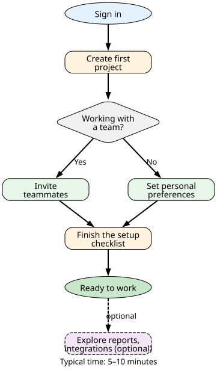
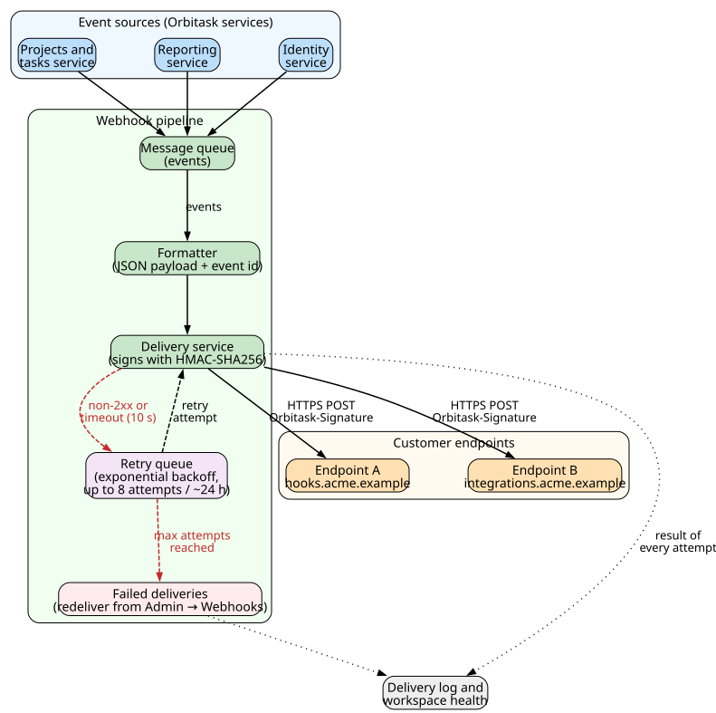

# Orbitask User Manual

**Author:** John Saysitall  
**Version:** Orbitask 1.8.0 · August 2026

---

## About this manual

- **Product:** Orbitask, a fictional cloud project-management service used for demonstration
- **Audience:** Team members, project managers, and workspace administrators
- **Before you start:** You need an account in an Orbitask workspace and the latest or previous version of Chrome, Edge, Firefox, or Safari.
- **Ways to work:** The web app at `https://app.orbitask.example`, the `orbitask` command-line tool (CLI), and the REST API

---

## Quick start

1. **Activate your account.**
   Open the invitation email and click **Accept invitation**. If your workspace uses single sign-on, you sign in through your company's identity provider; otherwise, set a password and turn on two-factor authentication (recommended).

2. **Install the CLI (optional).**
   Download the CLI for your operating system from `https://downloads.orbitask.example/cli/1.8.0/`, then sign in and set a default project:

   ```bash
   orbitask login --workspace acme-eng
   orbitask config set default-project "getting-started"
   ```

3. **Create your first project.**
   On the dashboard, click **New project**, choose a template, and invite your team. You can import existing tasks from CSV; see [Import and export data](#import-and-export-data).



---

## Projects

A project groups related tasks, milestones, and dashboards. Everyone in the workspace can see a project according to their [workspace role](#roles-and-permissions).

### Project templates

| Template | Use case | Includes |
|----------|----------|----------|
| **Agile sprint** | Software development | Story points, burndown chart, sprint planning board |
| **Marketing campaign** | Content and promotion | Asset library, campaign timeline, budget tracking |
| **Event planning** | Conferences and meetings | Vendor list, budget tracking, attendee list |
| **General purpose** | Anything else | Tasks, milestones, and file sharing |

### Create a project

1. Go to **Projects → New project**.
2. Choose a template, or click **Start blank**.
3. Enter the project details, for example:

   ```text
   Project name: Q1 Product Launch
   Description:  Customer portal 2.0 release preparation
   Timeline:     90 days
   ```

4. Choose notification settings, then click **Create**.

   *Result:* The project opens on its task board. If you chose a template, the board already contains the template's starter tasks.

To do the same from the CLI:

```bash
orbitask project create "Q1-Product-Launch" --template agile --duration 90d
orbitask project config set notifications.daily_digest=true
orbitask project config set reporting.auto_export=weekly
```

---

## Tasks

A task is one piece of work. Tasks move through a status workflow from **Backlog** to **Done**.

### Task fields

| Field | Type | Required | Description |
|-------|------|----------|-------------|
| **Title** | Text, up to 100 characters | Yes | Short description of the work |
| **Description** | Rich text | No | Details and acceptance criteria |
| **Assignee** | Workspace member | No | The person responsible. A task without an assignee stays in **Backlog** until someone is assigned. |
| **Priority** | Low, Medium, High, Critical | Yes | Defaults to Medium |
| **Due date** | Date and time | No | Target completion |
| **Estimate** | Hours | No | Expected effort |
| **Tags** | List of labels | No | For filtering and reports |
| **Dependencies** | Other tasks | No | Tasks that must finish first |

### Create a task in the web app

1. Open the project.
2. Click **New task**, or press `C`.
3. Fill in the fields, for example:

   ```text
   Title:     Implement user authentication API
   Assignee:  sarah.developer@acme.example
   Priority:  High
   Due date:  2026-10-02
   Estimate:  16
   Tags:      backend, security, api
   ```

4. Click **Save**.

   *Result:* The task appears in the **Backlog** column of the board. Drag it to **In progress** when work starts.

### Create tasks from the CLI

```bash
# Create one task
orbitask task create \
  --title "Implement user authentication API" \
  --assignee "sarah.developer@acme.example" \
  --priority high \
  --due 2026-10-02 \
  --estimate 16h \
  --tags "backend,security,api"

# Create a task that depends on another
orbitask task create \
  --title "Deploy authentication to staging" \
  --depends-on TASK-123 \
  --assignee "devops@acme.example"
```

To create many tasks at once, use `orbitask import tasks`; see [Import and export data](#import-and-export-data).

### Task statuses

Workspace Admins can rename or add statuses. The defaults are:

| Status | Meaning | Automatic actions |
|--------|---------|-------------------|
| **Backlog** | Not yet assigned or scheduled | None |
| **In progress** | Someone is working on it | Included in the daily digest |
| **Code review** | Waiting for peer review | Notifies reviewers |
| **Testing** | In QA | Notifies the QA assignee |
| **Staging** | Ready for release | Marked as releasable |
| **Done** | Complete | Stops time tracking |
| **Blocked** | Waiting on something outside the team | Notifies the project's Admins |

Change statuses from the CLI:

```bash
# One task
orbitask task update TASK-123 --status in-progress

# All of one person's backlog tasks
orbitask task update --assignee "sarah.developer@acme.example" \
  --current-status backlog \
  --new-status in-progress

# Block a task and record why
orbitask task update TASK-456 --status blocked \
  --reason "Waiting for API specification approval"
```

---

## Roles and permissions

Roles are assigned **per workspace**. Every project in the workspace inherits the member's workspace role; there are no separate project roles. A workspace always has at least one Owner.

| What you can do | Owner | Admin | Member | Viewer |
|-----------------|:-----:|:-----:|:------:|:------:|
| View projects, tasks, dashboards, and reports | Yes | Yes | Yes | Yes |
| Create and edit tasks and comments | Yes | Yes | Yes | — |
| Create projects and generate reports | Yes | Yes | Yes | — |
| Edit project settings, archive or delete projects | Yes | Yes | — | — |
| Invite and remove members, change roles (except Owner) | Yes | Yes | — | — |
| Manage webhooks, connectors, and the self-hosted agent | Yes | Yes | — | — |
| Configure SSO, SCIM, and domain verification | Yes | — | — | — |
| Manage billing, assign the Owner role, delete the workspace | Yes | — | — | — |

**API tokens** act with the role of the user who created them. Token scopes can narrow that access but never widen it.

If you use SCIM, map IdP groups to these roles in **Admin → Security → Provisioning**; see [SCIM provisioning](installation-setup-guide.md#scim-provisioning).

### Manage members

```bash
# Invite a member
orbitask team invite user@acme.example --role member

# Change a role
orbitask team update-role user@acme.example --role admin

# List members and roles
orbitask team list --format table
```

Sample output:

```text
┌──────────────────────────┬────────┬──────────────┐
│ Email                    │ Role   │ Last active  │
├──────────────────────────┼────────┼──────────────┤
│ dana.owner@acme.example  │ Owner  │ 1 day ago    │
│ john.admin@acme.example  │ Admin  │ 30 min ago   │
│ sarah.dev@acme.example   │ Member │ 2 hours ago  │
│ anna.qa@acme.example     │ Member │ 4 hours ago  │
│ finance@acme.example     │ Viewer │ 3 days ago   │
└──────────────────────────┴────────┴──────────────┘
```

---

## Comments and notifications

### Comments

Each task has a comment thread. Mention people with `@name`.

```bash
orbitask task comment TASK-123 \
  --message "Switched the endpoint to OAuth 2.0" \
  --mention "mike.pm@acme.example"

orbitask task comments TASK-123 --since 2026-09-01
```

### Notification defaults

| Notification | Email | In-app | Slack | Microsoft Teams |
|--------------|:-----:|:------:|:-----:|:---------------:|
| Task assigned to you | Yes | Yes | Yes | — |
| Due date approaching | Yes | Yes | — | — |
| Status changed | — | Yes | Yes | Yes |
| New comment | — | Yes | Yes | — |
| Project milestone reached | Yes | Yes | Yes | Yes |

Change these in **Settings → Notifications**, or from the CLI:

```bash
orbitask user config set notifications.email.task_assigned=true
orbitask user config set notifications.slack.status_changes=true
orbitask user config set notifications.digest_frequency=daily
```

---

## Reports and dashboards

### Dashboard metrics

| Metric | How it is calculated | Typical target |
|--------|----------------------|----------------|
| **Velocity** | Story points completed per sprint | Within 20% of the team average |
| **Burndown rate** | Tasks completed per day | On track for the project end date |
| **Cycle time** | Average time from **In progress** to **Done** | Shorter than the previous period |
| **Utilization** | Active tasks per team member | 80–90% |

### Generate reports from the CLI

```bash
# Project summary as PDF
orbitask report generate --type summary \
  --project "Q1-Product-Launch" \
  --period last-30-days \
  --format pdf \
  --output reports/q1-summary-2026-09.pdf

# Custom CSV report
orbitask report generate --type custom \
  --metrics "velocity,burndown,cycle_time" \
  --filter "priority:high,status:done" \
  --group-by assignee \
  --format csv
```

Sample summary:

```text
Project: Q1 Product Launch
Period:  August 1–31, 2026
Tasks:   127 total | 89 done | 38 open

┌──────────────────┬──────────┬───────────┬──────────────┐
│ Member           │ Assigned │ Done      │ Avg duration │
├──────────────────┼──────────┼───────────┼──────────────┤
│ Sarah Developer  │ 23       │ 21 (91%)  │ 2.3 days     │
│ Mike PM          │ 15       │ 14 (93%)  │ 1.8 days     │
│ Anna QA          │ 18       │ 16 (89%)  │ 3.1 days     │
└──────────────────┴──────────┴───────────┴──────────────┘
```

Large reports run in the background; Orbitask emails you a download link when they are ready.

---

## API

API v2 is the current version for all endpoints. API v1 is deprecated and stops working on **2026-11-16**; see [Release Notes](release-notes.md#deprecations).

### Authenticate

```bash
# Create a token with only the scopes you need
orbitask auth token create --name "ci-integration" --scope "projects:read,tasks:write"

export ORBITASK_API_TOKEN="<TOKEN>"
export ORBITASK_API_URL="https://api.orbitask.example/v2"
```

### Common requests

```bash
# List in-progress tasks in a project
curl -H "Authorization: Bearer $ORBITASK_API_TOKEN" \
     "$ORBITASK_API_URL/projects/Q1-Product-Launch/tasks?status=in-progress"

# Create a task (the Idempotency-Key makes retries safe)
curl -X POST \
     -H "Authorization: Bearer $ORBITASK_API_TOKEN" \
     -H "Content-Type: application/json" \
     -H "Idempotency-Key: 6f1c2e0a-5d7b-4b1e-9a57-0c3e8a1d2f44" \
     -d '{"title": "Fix authentication bug", "assignee": "sarah.developer@acme.example",
          "priority": "high", "tags": ["bugfix", "security"]}' \
     "$ORBITASK_API_URL/projects/Q1-Product-Launch/tasks"

# Move all of one person's tasks from Code review to Testing
curl -X PATCH \
     -H "Authorization: Bearer $ORBITASK_API_TOKEN" \
     -H "Content-Type: application/json" \
     -d '{"filter": {"assignee": "sarah.developer@acme.example", "status": "code-review"},
          "update": {"status": "testing"}}' \
     "$ORBITASK_API_URL/tasks/bulk-update"
```

Each token can make up to 1,000 requests per minute. See [API errors and rate limits](maintenance-troubleshooting.md#api-errors-and-rate-limits).

---

## Webhook configuration

Webhooks send an HTTPS `POST` to your endpoint when something happens in Orbitask. Workspace Owners and Admins manage them in **Admin → Webhooks**, or from the CLI:

```bash
# Create a webhook; Orbitask generates the signing secret and shows it once
orbitask webhook create \
  --url "https://hooks.acme.example/orbitask" \
  --events "task.created,task.completed,project.milestone"

# Send a test event
orbitask webhook test wh_123 --event task.created

# List webhooks
orbitask webhook list --format table
```

### Payload

```json
{
  "id": "evt_01J9X4K2T7Q8M3N5P6R",
  "event": "task.completed",
  "timestamp": "2026-09-10T14:30:00Z",
  "workspace": "acme-eng",
  "project": "Q1-Product-Launch",
  "data": {
    "task_id": "TASK-123",
    "title": "Implement user authentication API",
    "assignee": "sarah.developer@acme.example",
    "completed_at": "2026-09-10T14:29:45Z",
    "duration_hours": 14.5
  }
}
```

Every event has a unique `id`. Orbitask can deliver the same event more than once (for example, after a retry), so store the IDs you have processed and skip repeats.

### Delivery and retries

- Your endpoint must return a 2xx status within 10 seconds.
- Any other result is retried with exponential backoff, up to 8 attempts over about 24 hours.
- After the last attempt, the delivery is marked **Failed**. You can redeliver it from **Admin → Webhooks → Deliveries**.



### Verifying webhook signatures

Each request carries an `Orbitask-Signature` header:

```text
Orbitask-Signature: t=1789000000,v1=5257a869e7ecebeda32affa62cdca3fa51cad7e77a0e56ff536d0ce8e108d8bd
```

- `t` is the Unix time when Orbitask signed the request.
- `v1` is a hex-encoded HMAC-SHA256 of the string `<t>.<raw request body>`, keyed with your webhook's signing secret. While you rotate a secret, the header contains one `v1` value per active secret.

To verify a request:

1. Read the **raw** request body, before any JSON parsing. Re-serialized JSON will not match.
2. Reject the request if `t` is more than 300 seconds from your server's current time. This blocks replayed requests.
3. Compute the HMAC and compare it to each `v1` value with a constant-time comparison.
4. Return `401` if verification fails; otherwise process the event and return `2xx`.

Python example (standard library only):

```python
import hashlib
import hmac
import time

TOLERANCE_SECONDS = 300  # reject deliveries signed more than 5 minutes ago


def verify_signature(secret, header, raw_body, now=None):
    """Return True if an Orbitask-Signature header matches the raw request body."""
    timestamp, signatures = None, []
    for item in header.split(","):
        key, _, value = item.strip().partition("=")
        if key == "t" and value.isdigit():
            timestamp = int(value)
        elif key == "v1":
            signatures.append(value)
    if timestamp is None or not signatures:
        return False

    now = time.time() if now is None else now
    if abs(now - timestamp) > TOLERANCE_SECONDS:
        return False

    signed_payload = str(timestamp).encode() + b"." + raw_body
    expected = hmac.new(secret.encode(), signed_payload, hashlib.sha256).hexdigest()
    # During secret rotation the header carries one v1 value per active secret.
    return any(hmac.compare_digest(expected, sig) for sig in signatures)


if __name__ == "__main__":
    # Self-test: sign a body the way Orbitask does, then verify it.
    secret = "whsec_test_secret"
    body = b'{"id":"evt_01J9X4K2T7","event":"task.completed"}'
    t = int(time.time())
    sig = hmac.new(secret.encode(), f"{t}.".encode() + body, hashlib.sha256).hexdigest()
    header = f"t={t},v1={sig}"

    assert verify_signature(secret, header, body)
    assert not verify_signature(secret, header, body + b" ")          # body changed
    assert not verify_signature("wrong", header, body)                 # wrong secret
    assert not verify_signature(secret, header, body, now=t + 301)     # too old
    print("signature checks passed")
```

Save it as `verify_orbitask.py` and run `python verify_orbitask.py`; it prints `signature checks passed`. In your web framework, call `verify_signature()` with the secret, the `Orbitask-Signature` header, and the raw body bytes.

---

## Import and export data

### Supported formats

| Format | Import | Export | Typical use |
|--------|:------:|:------:|-------------|
| **CSV** | Yes | Yes | Bulk task changes, spreadsheets |
| **JSON** | Yes | Yes | Integrations, full backups |
| **Excel (.xlsx)** | Yes | Yes | Planning and stakeholder reports |
| **PDF** | — | Yes | Summaries and archives |

### Import

```bash
# Check a CSV file without importing it
orbitask import tasks --file project-tasks.csv --project "Q1-Product-Launch" --dry-run

# Import it
orbitask import tasks --file project-tasks.csv --project "Q1-Product-Launch"

# Import from Jira using a field mapping
orbitask import tasks --source jira --project-key PROJ \
  --mapping-file jira-orbitask-mapping.json --project "Q1-Product-Launch"
```

Sample CSV (only `title` is required):

```csv
title,assignee,priority,due_date,estimate_hours,tags,description
"Design login UI","ui.designer@acme.example","Medium","2026-09-25",8,"frontend,design","Mockups for the sign-in screens"
"Write API documentation","","Low","2026-10-09",4,"documentation,api","Document the authentication endpoints"
"Set up monitoring","devops@acme.example","High","2026-09-30",12,"infrastructure","Alerts for the auth service"
```

The second row has no assignee, so that task is created in **Backlog**.

### Export

```bash
# Everything in one project, with comments and attachments
orbitask export project "Q1-Product-Launch" \
  --format json --include-comments --include-attachments \
  --output backup-q1-launch.json

# Selected fields of completed high-priority tasks
orbitask export tasks \
  --filter "priority:high,status:done" \
  --format csv \
  --fields "title,assignee,created_at,completed_at" \
  --output high-priority-done.csv
```

To export a whole workspace, see [Export your data](maintenance-troubleshooting.md#export-your-data).

---

## Keyboard shortcuts

Single-key shortcuts do not work while you are typing in a text field. Press `?` in the app to see the full list.

| Action | Windows / Linux | macOS |
|--------|-----------------|-------|
| Search and run commands | `Ctrl+K` | `Cmd+K` |
| Create a task | `C` | `C` |
| Go to projects | `G` then `P` | `G` then `P` |
| Go to my tasks | `G` then `M` | `G` then `M` |
| Move to the next / previous task | `J` / `K` | `J` / `K` |
| Select the focused task | `X` | `X` |
| Mark selected tasks complete | `Ctrl+Enter` | `Cmd+Enter` |
| Show or hide the sidebar | `[` | `[` |
| Show all shortcuts | `?` | `?` |

---

## Troubleshooting

| Problem | What to try |
|---------|-------------|
| You cannot sign in with SSO | Sign out of your identity provider, then try again. If it still fails, ask your workspace Admin; see [SSO and SCIM issues](maintenance-troubleshooting.md#sso-and-scim-issues). |
| A project or task is missing | Check the board filters. If the project is still missing, you may not have access; ask a workspace Admin. |
| Dashboards load slowly | Narrow the date range or filter by project. |
| CLI says `ORB001` | Your token expired or was revoked. Run `orbitask login` again or create a new token. |

Workspace Admins can find more fixes in [Maintenance & Troubleshooting](maintenance-troubleshooting.md).

### Error codes

| Code | HTTP status | Meaning | What to do |
|------|-------------|---------|------------|
| **ORB001** | 401 | Token missing, expired, or revoked | Sign in again or create a new token |
| **ORB002** | 403 | Your role or the token's scopes do not allow this | Ask a workspace Admin; check the [roles table](#roles-and-permissions) |
| **ORB003** | 429 | Rate limit exceeded | Wait for the time in the `Retry-After` header |
| **ORB004** | 400 | Invalid data, such as a missing title | Fix the fields named in the error message |
| **ORB005** | 503 | Service temporarily unavailable | Check `https://status.orbitask.example` and retry later |
| **ORB006** | 410 | API v1 endpoint called after 2026-11-16 | Switch to API v2 |

### Getting support

- **Help center:** `https://help.orbitask.example`
- **Support:** `support@orbitask.example`, or **Help → Contact support** in the app
- **Service status:** `https://status.orbitask.example`

Support response times depend on your plan and the severity of the issue; see [Contact support](maintenance-troubleshooting.md#contact-support).

---

## Glossary

- **Workspace**: The top-level container for projects, members, and settings.
- **Project**: A set of related tasks, milestones, and dashboards.
- **Task**: One piece of work, with a status and an optional assignee.
- **Role**: One of Owner, Admin, Member, or Viewer; assigned per workspace.
- **Sprint**: A fixed-length iteration in agile projects.
- **Milestone**: A significant checkpoint or deliverable in a project.
- **Burndown**: A chart of the work remaining over time.
- **Velocity**: How much work a team completes per sprint.
- **Cycle time**: Average time from starting a task to finishing it.
- **API token**: A credential for calling the API or using the CLI.
- **Webhook**: An HTTPS callback that Orbitask sends when an event happens.
- **Agent**: The optional self-hosted service that connects Orbitask to systems in your network.

---

*Orbitask is a fictional product created for portfolio demonstration. All features, URLs, and contact details are imaginary.*
