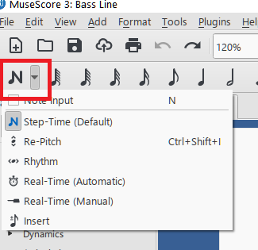
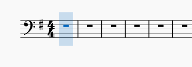
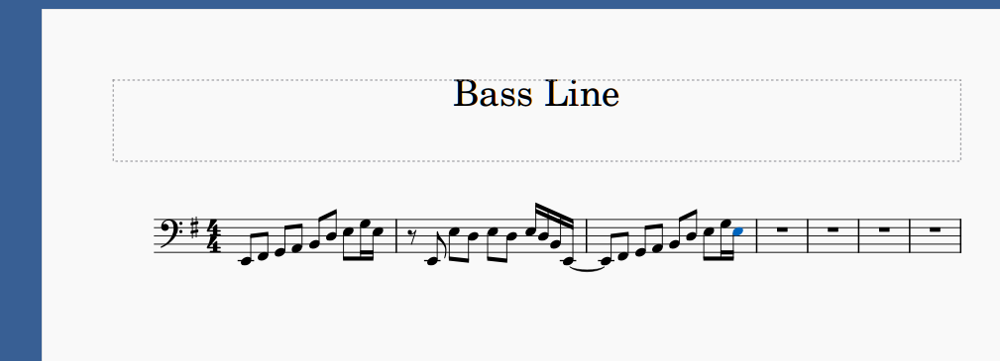
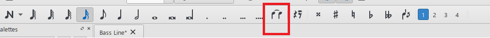
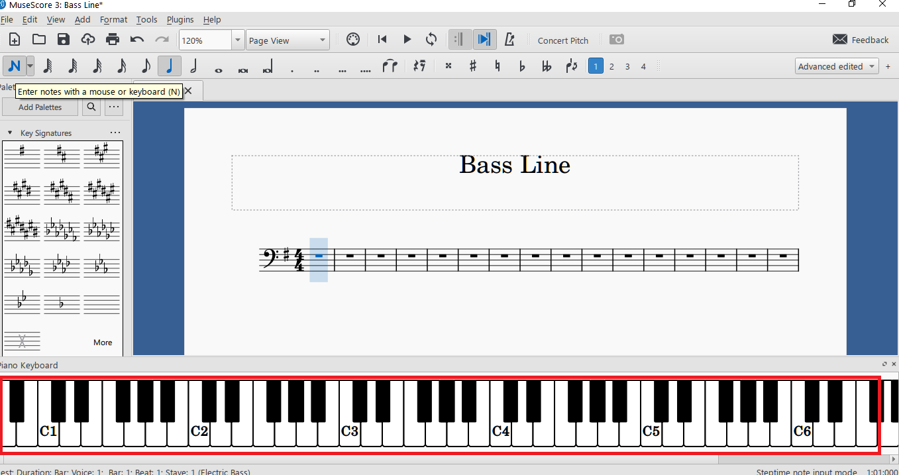
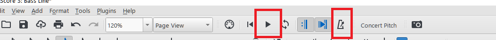

# Creating a music part

*Applies to MuseScore 3.6.2. The toolbars in MuseScore 4 are different.*

In this topic, you enter an electric bass part with the mouse and computer keyboard, and then play it back.

## About the sample scores

To keep the screenshots simple, this topic uses a separate single-staff score called "Bass Line". It contains only an Electric Bass staff. You can download both sample scores:

- [Bass_Line.mscz](Bass_Line.mscz): the single-staff score used in this topic, with the first measures already entered
- [Love_Song.mscz](Love_Song.mscz): the blank three-instrument score created in [Creating a score file](creating-a-score-file.md)

The steps are the same for the Electric Bass staff in Love Song.

> *Note:* This topic does not cover note entry from a MIDI keyboard or another external instrument.

## Enter the notes

1. Open your score, or create a score with an Electric Bass staff as described in [Creating a score file](creating-a-score-file.md).
2. Click the first measure of the Electric Bass staff.

   The measure is highlighted in blue.

3. Press <kbd>N</kbd>, or click the **Note input** button at the left end of the note input toolbar (the button with the *N* symbol).

   

   The arrow next to the button opens a list of input modes. The default mode, **Step-Time**, is the one used in this topic.

   A blue vertical bar appears at the start of the measure. It marks where the next note will go:

   

4. Choose a duration by clicking it on the note input toolbar, or by pressing a number key: for example, <kbd>4</kbd> for an eighth note or <kbd>5</kbd> for a quarter note. The quarter note is selected by default.
5. Type the letter name of the pitch, <kbd>A</kbd> to <kbd>G</kbd>.

   MuseScore enters that note, following the key signature, in the octave closest to the previous note. The bar moves on to the next beat.

   To correct the pitch of the note you just entered, press <kbd>Up</kbd> or <kbd>Down</kbd> to move it by a semitone, or <kbd>Ctrl</kbd>+<kbd>Up</kbd> or <kbd>Ctrl</kbd>+<kbd>Down</kbd> to move it by an octave.

6. Repeat steps 4 and 5 for each note. Always choose the duration first, then the pitch.
   - To enter a rest, press <kbd>0</kbd> or click the **Rest** button, to the right of the **Tie** button.
   - To add a sharp or flat, click the accidental buttons further right on the same toolbar.
7. When you have finished, press <kbd>Esc</kbd> to leave note input mode.

   The first measures of the part look like this:

   

### Ties and slurs

Ties and slurs look similar but mean different things:

- A *tie* joins two notes of the same pitch, so that they sound as one longer note. To add one, enter the first note and press <kbd>+</kbd>, or click the **Tie** button on the note input toolbar. MuseScore enters the tied note for you. In the example above, a tie joins the last note of measure 2 to the first note of measure 3.

  

- A *slur* joins notes of different pitches, to show they are played smoothly (legato) as one phrase. Select the first note and press <kbd>S</kbd>, then extend the slur with <kbd>Shift</kbd>+<kbd>Right</kbd>.

## Use the onscreen keyboard

If you prefer to click keys instead of typing letters, use the onscreen piano keyboard.

1. Press <kbd>P</kbd>, or select **View** > **Piano Keyboard**.

   A piano keyboard opens below the score:

   

2. With note input mode on, choose a duration, then click a piano key.

   MuseScore enters the note at the exact pitch of the key you clicked.

## Play the part

1. Click the **Play** button on the toolbar at the top of the window, or press <kbd>Space</kbd>.

   MuseScore plays the part from the selected note, or from the start of the score.

2. To hear the beat while the part plays, click the **Metronome** button. It is on the same toolbar, a few buttons to the right of **Play**.

