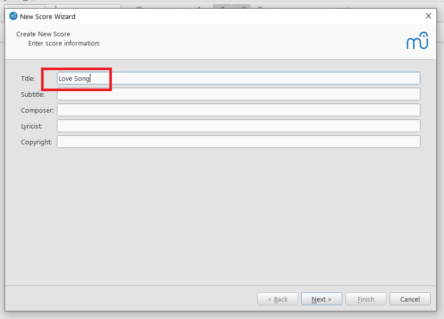
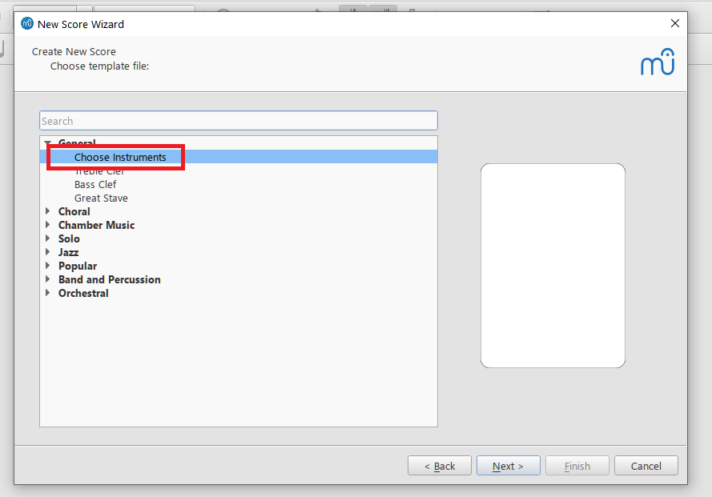
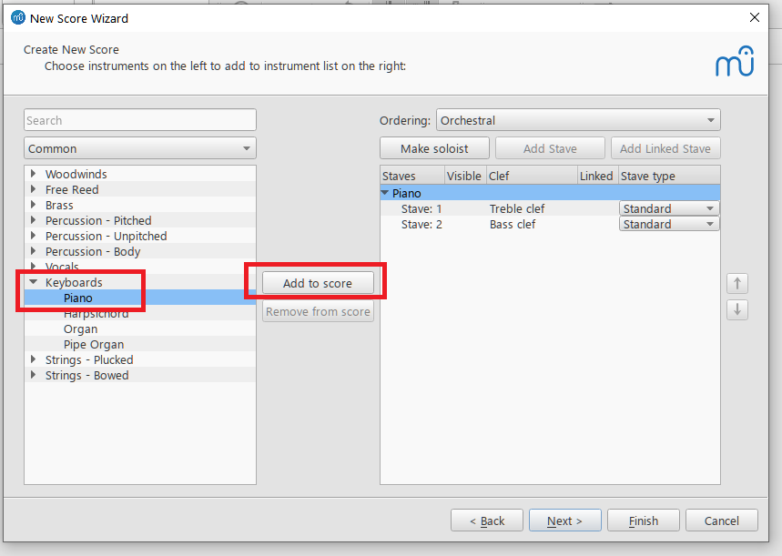
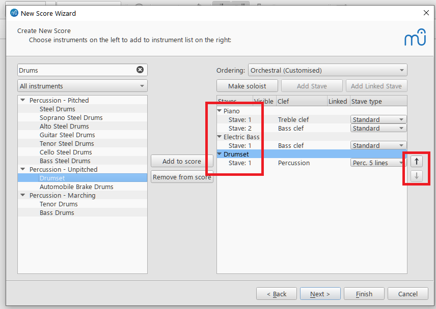
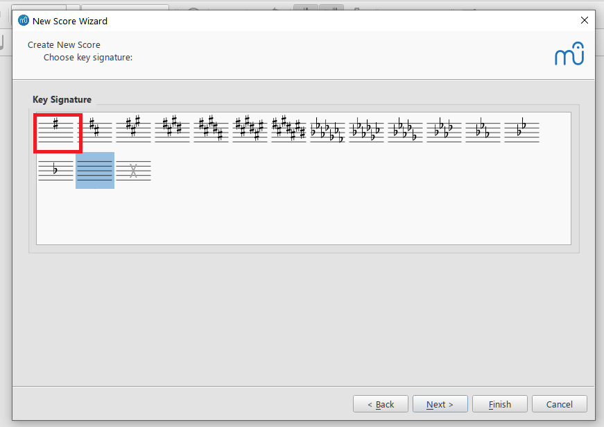
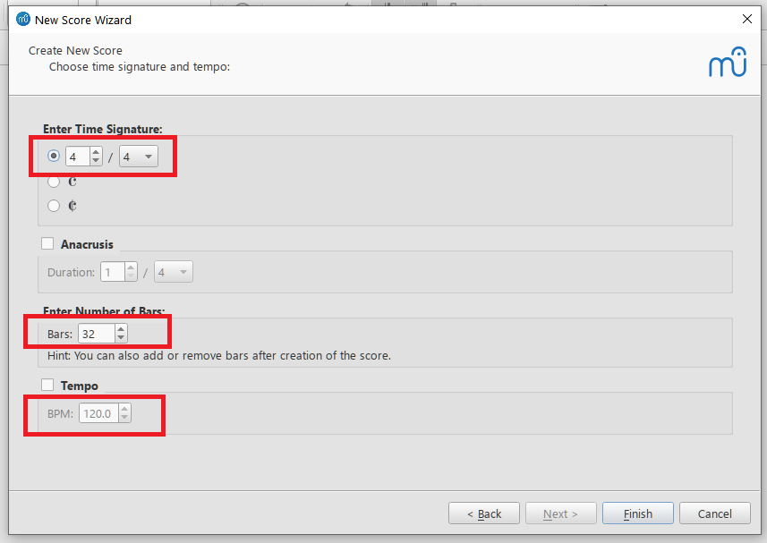
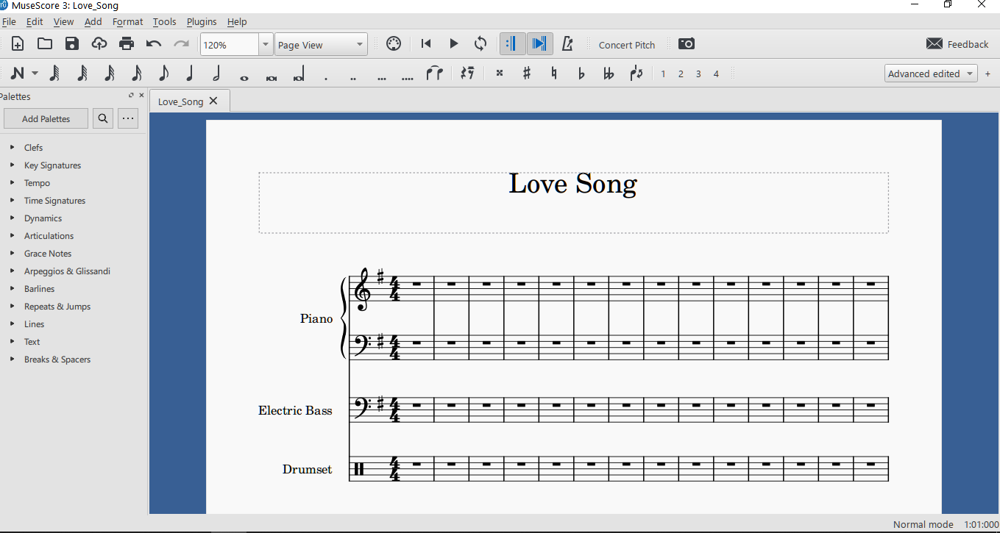

# Creating a score file

*Applies to MuseScore 3.6.2. The menus in MuseScore 4 are different.*

In this topic, you create a blank score for a small band (piano, electric bass, and drums) with the New Score wizard. The finished score is available as a sample: [Love_Song.mscz](Love_Song.mscz).

Before you start, download and install MuseScore 3.6.2 (see [MuseScore Music Notation App](introduction.md)).

1. Start MuseScore.
2. Select **File** > **New**.

   The **New Score Wizard** opens:

   

3. Enter the text that should appear on the score, such as **Title**, **Composer**, and **Copyright**. In this example, the title is "Love Song". Click **Next**.
4. In the next screen, double-click **Choose Instruments**.

   

   A list of instruments appears in the left pane.

5. Expand **Keyboards**, select **Piano**, and click **Add to score** (or double-click **Piano**).

   

   Piano appears in the right pane.

6. Add **Electric Bass** and **Drumset** the same way.

   The right pane now lists all three instruments:

   

   To change the order of the instruments on the score, use the arrow buttons to the right of the list.

7. Click **Next**.
8. Choose a key signature. This example uses E minor, which has one sharp.

   

   Click **Next**.

9. On the last screen of the wizard, you can set the time signature, the number of measures, and the tempo. Keep the defaults.

   

10. Click **Finish**.

    The wizard closes and the new score opens:

    

11. Select **File** > **Save** to save the score.

    MuseScore suggests a file name based on the title, with spaces replaced by underscores. In this example, the file name is `Love_Song.mscz`.

> *Note:* To change the page size, select **Format** > **Page Settings** and choose a size from the **Page Size** list.

<!-- separate notes -->

> *Warning:* A `.mscz` file is a compressed (zip) archive. Do not unpack or edit it with other tools. If you do, MuseScore may report the file as corrupt.

You can now enter notes. Continue with [Creating a music part](creating-a-music-part.md).
