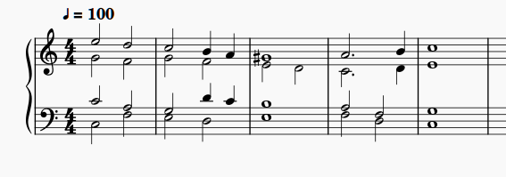

# MuseScore Music Notation App

*Applies to MuseScore 3.6.2. The menus and toolbars in MuseScore 4 are different, so some steps in these topics do not match MuseScore 4.*

## What is MuseScore?

MuseScore is an open-source program for writing music scores. You can write for solo instruments or for ensembles of any style, from classical to rock, with the symbols a score needs: clefs, key and time signatures, accidentals, dynamics, articulations, and phrasing marks. Scores can be laid out for common contemporary page sizes.

## Overview

Engraving music used to take skilled craftspeople and expensive printing. With notation software, musicians can write and print scores on their own computers.

You can enter notes with the mouse, the computer keyboard, or a MIDI keyboard. MuseScore saves scores as `.mscz` files: compressed files that contain the score in MuseScore's own XML format, similar to MusicXML. You can play a score back on the computer, export it as MIDI, MusicXML, PDF, or audio, and print it.

Here is a short example of a finished score:

The following topics show how to create a score and enter a part:

1. [Creating a score file](creating-a-score-file.md)
2. [Creating a music part](creating-a-music-part.md)
3. [Frequently used features](frequently-used-features.md)

---

Installers for Windows, macOS, and Linux are available from the official MuseScore site, [musescore.org](https://musescore.org). These topics and their screenshots use MuseScore 3.6.2, which is listed with the older releases on the same site.
