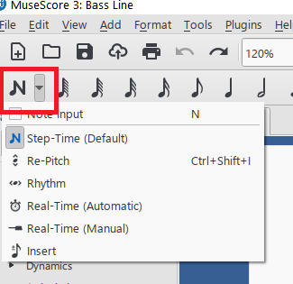
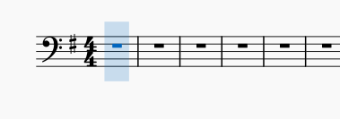
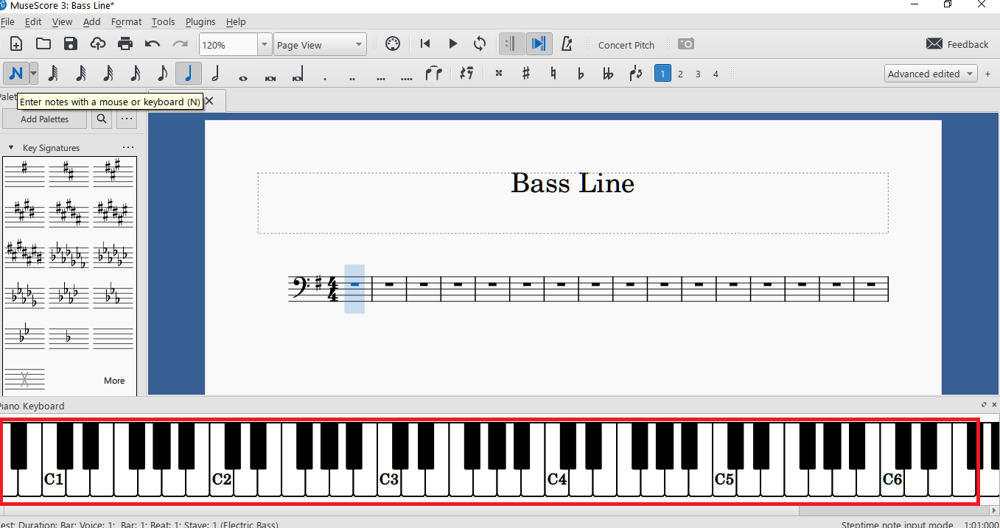
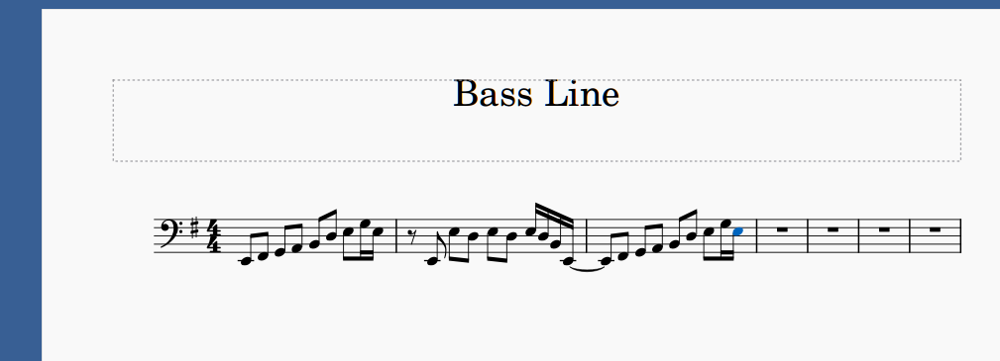
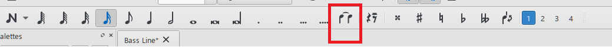
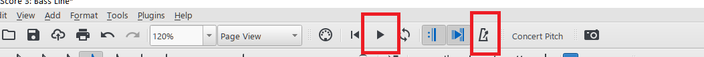

# Creating A Music Part

In this topic, we will show you how to enter a music part in a MuseScore document. For our purposes, and to keep things simple, we will create an electric bass part.

## Creating the file

For the process of creating the score file, see [Creating A Score File](creating-a-score-file.md).

## Entering notes

We will assume you will enter the notes using your mouse and keyboard.

> __NOTE__
> This topic does not cover the MIDI-based method of using an external instrument for note entry&mdash;such as a synthesizer keyboard.

To start entering notes, click on the note entry drow down box (the _N_ shaped one) at the beginning of the lower toolbar.

For our purposes, the first option&mdash;_Note Input_&mdash;is good enough. Note that this command can be accessed by simply typing _N_ on your keyboard. Clicking this option activates the note entry process which is indicated on the staff with a transparent blue vertical rectangle.

## Onscreen keyboard

If entering the notes by typing their letters on the keyboard is not intuitive enough for you, you can try a more __visual__ method: using the onscreen keyboard. Typing _P_ on the keyboard opens a piano keyboard at the bottom of the score screen.

By clicking on the onscreen piano keys while note entry is activated, you can enter the line.

For time values, the second toolbar provides options for whole, half, quarter, etc. notes. By default, the quarter note is selected.

> __NOTE__
> The entry process may get tedious and frustrating. Try to be patient and always pick the time value first, and then either press the letter of the relevant note on the keyboard or click the corresponding line or space on the staff with your mouse pointer.

You can see the first few bars of the line entered below:

To enter "ties" and "slurs"&mdash;to connect note heads in order to extend their duration or to group them for phrasing&mdash;you can use the _Tie_ button on the second toolbar.

The rests are placed to the right of the tie button, along with accidentals such as sharp, flat, etc.

## Playing the part

If you want to hear the notes you have entered so far, you can press the _Play_ button to play back the created part. If you want to hear the underlying tempo as a beat, you can press the metronome button to its right.

