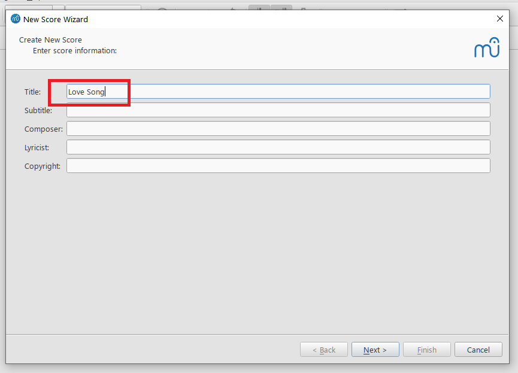
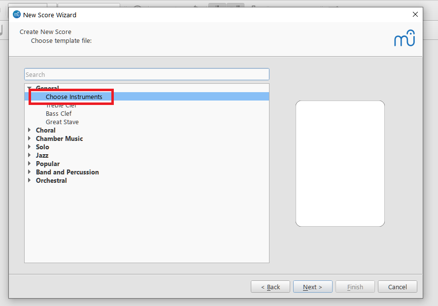
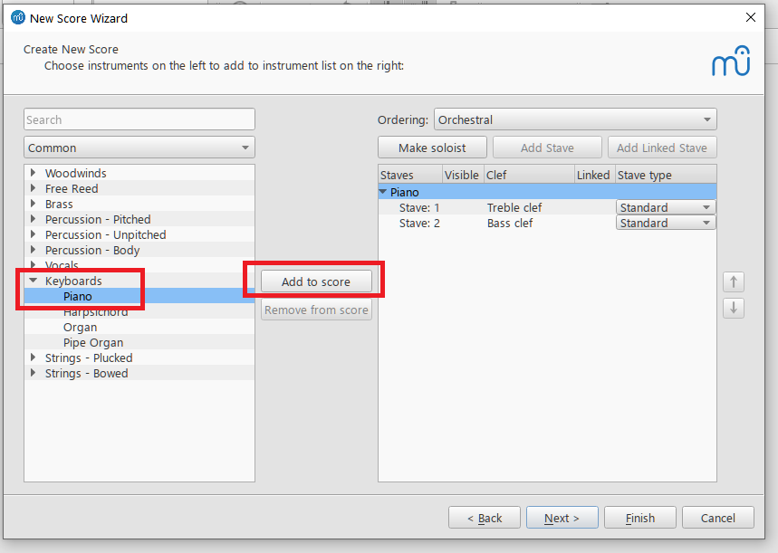
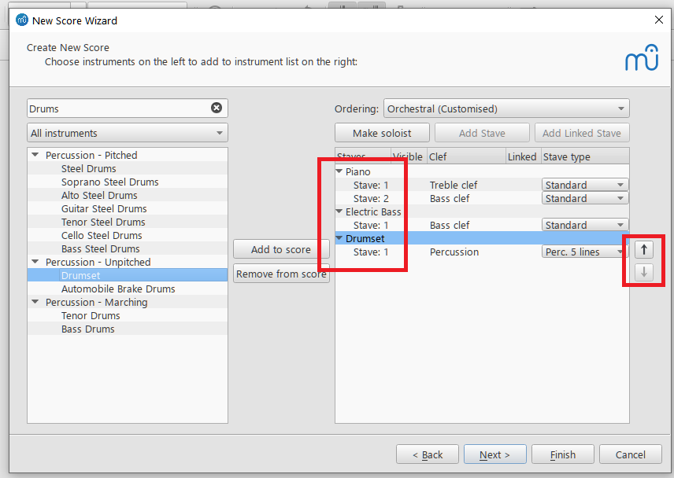
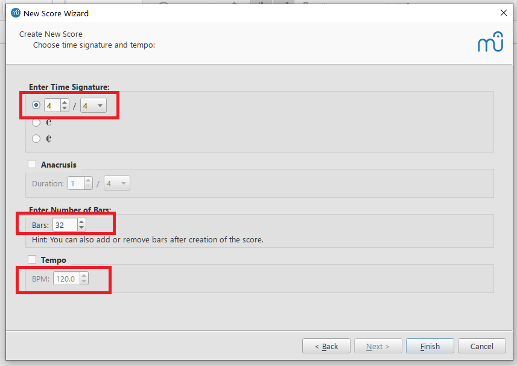

# Creating A Score File

In order to create score files, you should have downloaded and installed the program. To create a score file, follow the steps below.

1. Launch MuseScore.
2. Create a new document by selecting _File_ > _New_ which opens the "_New Score Wizard_" you can see below:

   

   In this screen, you can enter text to be placed in the score such as _Title_, _Composer_, _Copyright_ for the score. Our title will be simply "Love Song."

   Once these are entered, click _Next_.

3. In the next screen, double click on _Choose Instruments_.

   

   A list of instruments will appear in the left pane. Expand the _Keyboards_ branch and select _Piano_. Once you've selected an instrument, you can either double click its name or click the _Add to score_ button to add it to the right pane.

   

   Then do the same for _Electric Bass_ and _Drums_. Once these are also added, the right-hand pane should look like this:

   

   The arrows on the right hand side can be used to change the position of the instrument on the score.

   Click _Next_ again.

4. On the next screen, you can pick a key signature:

   

   Here, we will pick the single-sharp (#) _E minor_ as our key.

   Click _Next_.

5. We have arrived at the final screen of the wizard where we can pick a time signature, number of bars, and tempo.

   

   Pick the defaults and click _Finish_ to complete the wizard:

6. After the wizard closes, the score should look like this:

   

> __NOTE__
> If you are not happy with the page size, this can be changed by going to _Format_ > _Page Settings_ and picking the desired page size from the _Page Size_ drop down box.

Don't forget to click _File_ > _Save_ to save your newly created score. MuseScore will suggest a filename based on the title of the score, replacing spaces with underscores&mdash;in our case, that will be "Love_Song".

> __WARNING__
> By default, MuseScore files have the __.mscz__ extension. Although this is actually a __zip__ file it should not be tampered with or modified as MuseScore will not recognize any other file type or extension.

You are now ready to enter the notes of your score.
