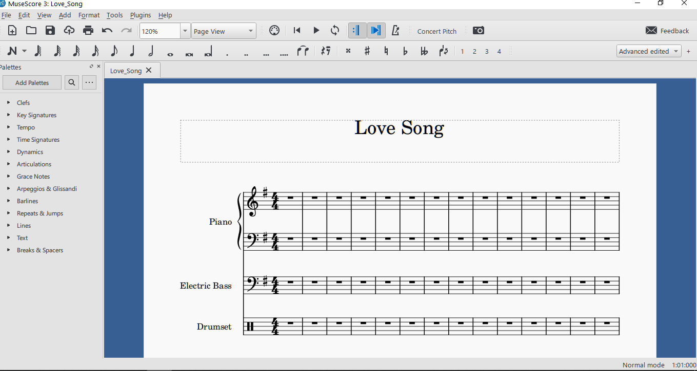

# Creating A Score File

In order to create score files, you should have downloaded and installed the program. To create a score file&mdash;to which MuseScore gives by default the extension ".mscz"&mdash;follow the steps below.

1. Launch MuseScore. You should see the screen below:

   

2. Create a new document by selecting _File_ > _New_ which opens the "_New Score Wizard_" you can see below:

   

   Here you can enter a title for the document&mdash;here, our title is simply "Bass Line"&mdash;after which you click _Next_.

3. In the next screen, when you click on _Choose Instruments_ a list of instruments will appear. Here, expand the _Strings - Plucked_ branch and select _Electric Bass_:

   

   Once you've selected it, you can either double click it or click the _Add to score_ button to add the instrument to the right pane.

   

4. After this you can click _Next_ again to move to the screen where you can pick a key signature:

   

   Here, we will pick the single-sharp (#) _E minor_ as our key and click _Next_. We arrive at the final screen where we can pick a time signature, number of bars, and tempo. We will pick the defaults and click _Finish_ to complete the wizard:

   

5. After the wizard closes, the score should look like this:

   

Don't forget to click _File_ > _Save_ to save your newly created score. MuseScore will provide a default filename based on the title of the score, replacing spaces with underscores&mdash;in our case, that will be "Bass_Line".

> __NOTE__
> If you are not happy with the page size, this can be changed by going to _Format_ > _Page Settings_ and picking the desired page size from the _Page Size_ drop down box.
