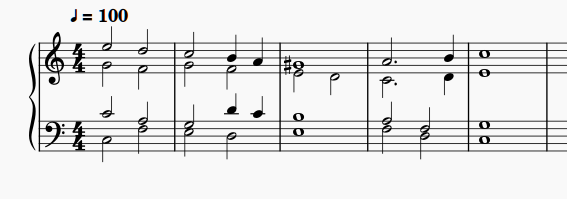

# MuseScore Music Notation App

## What is MuseScore?

[MuseScore](https://www.musescore.com) is an open source program to create printable music scores. On this page, we will illustrate how the program can be used to create a music part.

## Overview

Users can enter the music parts by using a mouse, a computer keyboard, a digital music keyboard, etc. The entered information conforms to the MIDI standard, and is stored in files (*.mscz) structured in an XML-based format. The parts can then be played back on the computer, on MIDI-compliant music instruments, or printed on paper-based media.

Below, you can see a sample generated output:

