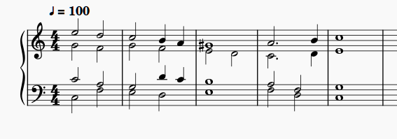

# MuseScore Music Notation App

## What is MuseScore?

MuseScore is an open-source program to create music scores. Scores for an extensive palette of classical, jazz, rock, popular, and other traditional and modern ensembles as well as a rich variety of solo instruments can be created easily and accurately with all the required symbols for clefs, keys, accidentals, dynamics, articulation, phrasing, and interpretation for various comtemporary page sizes.

## Overview

Before the digital technology arrived, creating music scores was a time-consuming and expensive process that required very skilled craftsmen to design and print. Computer software now makes this much more intuitive and inexpensive. Ordinary musicians can use their computers to create music scores.

MuseScore is probably one of the best available on the market. And it's free.

Users can enter music parts by using a mouse, a computer keyboard, a digital music keyboard, etc. The entered information conforms to the MIDI standard, and is stored in files structured in an XML-based format. The parts can then be played back on the computer, on MIDI-compliant music instruments, or printed on paper-based media.

Below, you can see a small example of the generated output:

In the following pages, we will illustrate how the program is used to create music parts.

---

The installation files of the program for Windows, Mac OS, and Linux can be downloaded from the official [MuseScore](https://www.musescore.com) site.

As of this writing MuseScore is at version 4.1.1, but in this documentation we will use version 3.6.2.
